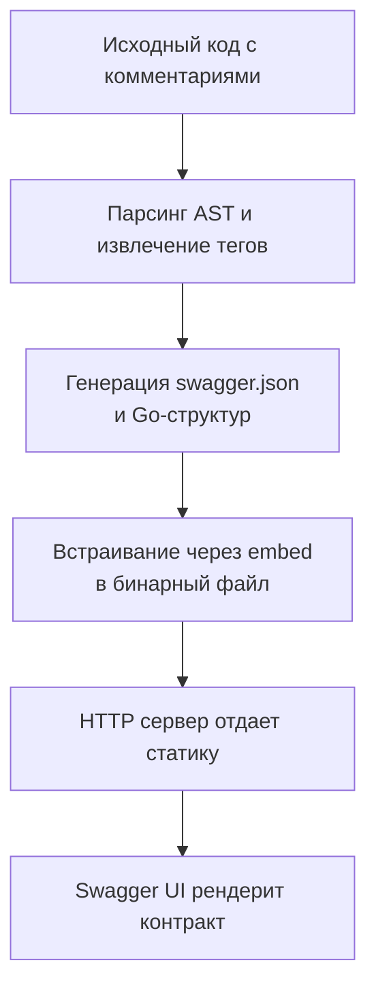

## Философия документации API в Go

В распределенных системах документация — это не текст для чтения, а машиночитаемый контракт. В эпоху микросервисов, API-шлюзов и автогенерации клиентских SDK, OpenAPI/Swagger спецификация становится единым источником истины (Single Source of Truth). В Go-экосистеме подход к документации радикально отличается от PHP или Python: здесь предпочтение отдается статической генерации, компиляционной проверке и минимальному влиянию на рантайм-производительность.

### 1. Подходы: Code-First vs Spec-First

Выбор стратегии определяет архитектуру проекта, скорость разработки и надежность контрактов.

- **Code-First**: Разработчик пишет код и аннотации, инструмент генерирует OpenAPI-спецификацию. Быстрый старт, но риск рассинхронизации (spec drift).
- **Spec-First**: Спецификация пишется вручную в YAML/JSON, затем генерируются серверные интерфейсы и клиентские типы. Гарантирует соответствие, но требует двойной работы на старте.



> [!info] Под капотом
> `swaggo/swag` (Code-First) работает на этапе компиляции, а не в рантайме. Он использует пакет `go/parser` для построения абстрактного синтаксического дерева (AST), рекурсивно обходит пакеты, извлекает комментарии-аннотации (`@tags`, `@param`, `@success`) через регулярные выражения и генерирует статический `.go` файл с `var swaggerJSON = []byte(...)`. Это исключает рефлексию при старте сервиса и не добавляет аллокаций в кучу. Бинарник увеличивается на 200-500 КБ, что пренебрежимо мало по сравнению с выигрышем в скорости.

### 2. Идиоматичная интеграция

В production-проектах спецификация встраивается напрямую в бинарник через `//go:embed`, что исключает чтение файлов с диска и ускоряет деплой.

```go
// cmd/server/docs.go
package docs

import (
    "embed"
    "io/fs"
    "net/http"
)

//go:embed swagger.json docs/*
var docsFS embed.FS

func NewHandler() http.Handler {
    // Отдаем корень как index.html (Swagger UI)
    staticFS, _ := fs.Sub(docsFS, "docs")
    return http.FileServer(http.FS(staticFS))
}

// Инициализация при старте (вызывается автоматически при импорте)
func init() {
    // swag сгенерировал init() с привязкой SwaggerInfo к скомпилированному JSON
    // docs.SwaggerInfo.ReadDoc() теперь работает без I/O
}
```

Интеграция с роутером:
```go
package main

import (
    "net/http"
    "myproject/internal/docs"
)

func setupRoutes() http.Handler {
    mux := http.NewServeMux()
    
    // Статические эндпоинты документации
    mux.Handle("/docs/", http.StripPrefix("/docs/", docs.NewHandler()))
    mux.HandleFunc("/docs/swagger.json", func(w http.ResponseWriter, r *http.Request) {
        w.Header().Set("Content-Type", "application/json")
        w.Write(docs.SwaggerInfo.ReadDoc()) // Возвращает []byte из embed
    })
    
    // Бизнес-маршруты...
    return mux
}
```

### 3. Выравнивание документации и валидации

Самая частая проблема: документация обещает одно, а валидатор (`github.com/go-playground/validator`) проверяет другое. В Go это решается через единые структуры тегов.

```go
type CreateUserRequest struct {
    // swagger:required true
    // @Description Full name of the user
    Name string `json:"name" validate:"required,min=2,max=100" example:"John Doe"`
    
    // swagger:required false
    Email string `json:"email" validate:"required,email" example:"user@example.com"`
}
```
При генерации `swag` читает `example`, `description` и `validate`-теги, автоматически выставляя `required` в OpenAPI-схеме. Это гарантирует, что `400 Bad Request` в документации совпадает с реальной логикой из статьи [[7. Валидация входных данных]].

> [!warning] Ловушка / Gotcha
> **Утечка внутренних полей**: `swag` рекурсивно проходит по всем экспортированным полям структуры. Если в DTO случайно осталось `PasswordHash string` или `InternalID int`, оно попадет в публичную документацию. Решение: использовать отдельные `Request`/`Response` DTO-структуры или тег `swaggerignore:"true"` для скрытия полей. Никогда не экспортируйте инфраструктурные поля в контрактах.
> **Рассинхронизация в CI**: Если разработчик меняет сигнатуру хендлера, но не запускает `swag init`, документация остается старой. Компилятор не проверит соответствие.

### 4. Spec-First и oapi-codegen

Для enterprise-систем предпочтителен подход, где спецификация контролируется отдельно. `github.com/deepmap/oapi-codegen` генерирует:
- Типизированные структуры запросов/ответов
- Интерфейсы `ServerInterface`, которые должен реализовать сервис
- Клиентский код для внешних вызовов

```go
// Генерируется автоматически из openapi.yaml
type ServerInterface interface {
    CreateUser(ctx echo.Context, request CreateUserJSONRequestBody) error
    GetUser(ctx echo.Context, userId int) error
}

// Реализация в сервисе
type APIServer struct{}
func (s *APIServer) CreateUser(ctx echo.Context, req CreateUserJSONRequestBody) error {
    // req уже валидирован по схеме OpenAPI
    // Никакой рефлексии при десериализации
}
```
Плюс: контракт компилируется. Минус: потеря гибкости, сложная миграция при изменении схем.

### 5. Производительность и Mechanical Sympathy

Подача документации в production имеет измеримую стоимость:
- **Embed vs Disk**: `//go:embed` компилирует файлы в секцию `.rodata` бинарника. Чтение происходит напрямую из памяти процесса через `mmap`. Задержка ~0.1 мкс. Чтение с диска или кеша прокси — 1-10 мс + syscall `open/read`.
- **Gzip сжатие**: `swagger.json` часто достигает 100-500 КБ. Без сжатия передача занимает 1-3 RTT. Встроенный `http.FileServer` не сжимает на лету. Решение: предсжатие `swagger.json.gz` через `gzip` на этапе сборки и кастомный `ReadDoc()`, отдающий сжатый поток с заголовком `Content-Encoding: gzip`.
- **Memory Footprint**: Swagger UI (HTML/JS/CSS) занимает ~5 МБ в памяти при загрузке. В кластере из 100 подов это 500 МБ суммарно. Рекомендуется отдавать UI через CDN, а в сервисе встраивать только `swagger.json` и минималистичный `index.html` (например, `scalar` или `rapidoc` вместо тяжелого `swagger-ui-dist`).

> [!tip] Собеседование
> **Вопрос:** Как гарантировать, что документация всегда соответствует коду без ручных проверок?
> **Ответ:** Интегрировать проверку в CI/CD пайплайн. Для Code-First: шаг `swag init -d ./... -g main.go --parseDependency`, затем `git diff --exit-code docs/swagger.json`. Если есть изменения, пайплайн падает. Для Spec-First: `oapi-codegen` генерирует файлы в `go generate`, и проверка `git status --porcelain` ловит расхождения. Компилятор гарантирует типы, но не семантику путей.
> 
> **Вопрос:** Почему runtime-генерация спецификации считается антипаттерном в Go?
> **Ответ:** Она требует парсинга отражений (`reflect`), чтения файлов и динамического формирования JSON при старте или первом запросе. Это создает аллокации в куче, увеличивает время запуска (cold start) и может содержать race conditions при конкурентных запросах. В Go предпочтительна статическая генерация на этапе сборки (`go build`), которая перекладывает работу на компилятор, а не на рантайм.

### 6. Ловушки и лучшие практики

- **Не документируйте реализации**: В спецификации должны быть только стабильные контракты. Временные хаки, внутренние заголовки или `X-Debug` поля не попадают в `openapi.yaml`.
- **Версионирование в путях**: Документируйте `/v1/` и `/v2/` отдельно. Используйте `info.version` и `servers` для указания актуального окружения.
- **Примеры ответов**: `@success 200 {object} UserResponse` обязателен. Без примеров автогенераторы клиентов создают бесполезные `null`-структуры.
- **Ошибки**: Документируйте `@failure 400`, `401`, `403`, `404`, `429`, `500` с единой структурой `ErrorResponse`. Это синхронизирует обработку ошибок из [[15. Error handling в сервисах]].

### Итог

1. В Go документация — это статический контракт, генерируемый на этапе сборки, а не динамический рантайм-отчет.
2. Code-Fast (`swag`) удобен для старта, Spec-First (`oapi-codegen`) надежен для масштабируемых систем.
3. Используйте `//go:embed` для встраивания статики, избегайте чтения файлов с диска в production.
4. Синхронизируйте теги валидации и OpenAPI-аннотации, чтобы спецификация отражала реальную логику сервиса.
5. Интегрируйте проверку соответствия кода и документации в CI-пайплайн через `git diff`.
6. Отдавайте тяжелый UI через CDN, в бинарник встраивайте только минимальный рендерер и `swagger.json`.

Правильно организованная документация превращается из "дополнительной работы" в инструмент разработки: автогенерация тестов, моков, клиентских библиотек и валидация запросов на уровне шлюза.

Следующая статья: [[34. Тестирование HTTP сервисов]]