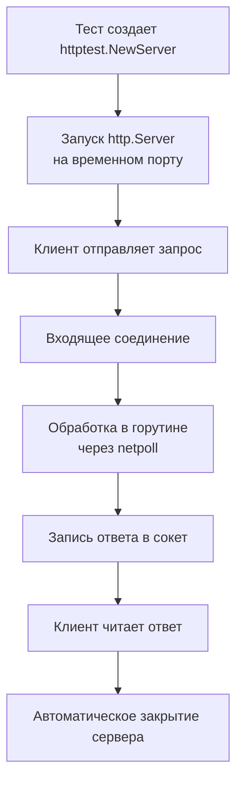

## Философия тестирования в Go

Тестирование HTTP-сервисов в Go радикально отличается от подходов в экосистемах Java, C# или PHP. Вместо тяжелых фреймворков, запускающих вложенные JVM или поднимающих mock-серверы на реальных портах, стандартная библиотека `net/http/httptest` предоставляет легковесные примитивы для in-memory исполнения. Это позволяет запускать тысячи тестов за секунды, полностью исключая накладные расходы на сетевой стек ядра, TCP-handshake и контекстные переключения.

Правильно написанный тест в Го — это не проверка кода, а проверка контракта. Он должен быть детерминированным, изолированным, быстро исполняться и явно демонстрировать ожидаемое поведение через таблицы данных, а не императивные блоки `if/else`.

1. Инструментарий: httptest и in-memory исполнение

Пакет `httptest` предоставляет два основных инструмента: `NewRecorder` и `NewServer`. Первый имитирует `http.ResponseWriter` в памяти, второй поднимает полноценный `http.Server` на временном порту.

```go
func TestGetUserHandler(t *testing.T) {
    // 1. Создаем запрос без реального сетевого соединения
    req := httptest.NewRequest(http.MethodGet, "/api/v1/users/42", nil)
    
    // 2. Создаем рекордер для захвата ответа
    w := httptest.NewRecorder()
    
    // 3. Вызываем обработчик напрямую
    handler := NewUserHandler(mockService)
    handler.ServeHTTP(w, req)
    
    // 4. Проверяем результат
    if w.Code != http.StatusOK {
        t.Errorf("expected status 200, got %d", w.Code)
    }
    
    var resp UserResponse
    if err := json.Unmarshal(w.Body.Bytes(), &resp); err != nil {
        t.Fatalf("invalid json response: %v", err)
    }
    
    if resp.ID != 42 {
        t.Errorf("expected user ID 42, got %d", resp.ID)
    }
}
```

> [!info] Под капотом
> `httptest.NewRecorder` реализует интерфейс `http.ResponseWriter`, но вместо записи в сокет буферизует заголовки и тело в `bytes.Buffer`. Это происходит в куче процесса. При вызове `WriteHeader()` статус сохраняется в поле `Code`, а `Header()` возвращает обычную `map[string][]string`. Никаких системных вызовов `sendto()` или `write()` не происходит. Задержка между вызовом `ServeHTTP` и получением результата измеряется наносекундами.

2. Механика исполнения без сетевого стека

Когда требуется протестировать полный цикл с клиентом (таймауты, редиректы, чтение тела ответа), используется `httptest.NewServer`. Он создает слушатель, но вместо `net.Listen("tcp", ":0")` применяет `net.Pipe()` для локальных соединений или открывает порт на `127.0.0.1:0` (порт выбирается ОС).



Связка `httptest.NewClient()` и `NewServer()` использует оптимизированный транспорт, который кеширует соединения и минимизирует syscall-ы. Однако для юнит-тестов хендлеров `NewRecorder` всегда предпочтительнее: он быстрее, не требует открытия файловых дескрипторов и не создает конкуренцию за порты в параллельных сьютах.

3. Идиоматичные паттерны: Table-Driven и Middleware

Тестирование маршрутов и промежуточных обработчиков в Го строится вокруг подтестов `t.Run`. Это позволяет изолировать кейсы, запускать их параллельно и получать детальный отчет по каждому сценарию.

```go
func TestAuthMiddleware(t *testing.T) {
    tests := []struct {
        name           string
        token          string
        expectedStatus int
    }{
        {"valid token", "Bearer valid_token_123", http.StatusOK},
        {"missing token", "", http.StatusUnauthorized},
        {"invalid prefix", "Basic token", http.StatusUnauthorized},
    }

    for _, tt := range tests {
        t.Run(tt.name, func(t *testing.T) {
            t.Parallel() // Параллельный запуск кейсов
            
            req := httptest.NewRequest(http.MethodGet, "/protected", nil)
            if tt.token != "" {
                req.Header.Set("Authorization", tt.token)
            }
            w := httptest.NewRecorder()
            
            // Оборачиваем заглушку в мидлвару
            mw := AuthMiddleware(func(w http.ResponseWriter, r *http.Request) {
                w.WriteHeader(http.StatusOK)
            })
            mw.ServeHTTP(w, req)
            
            if w.Code != tt.expectedStatus {
                t.Errorf("got %d, want %d", w.Code, tt.expectedStatus)
            }
        })
    }
}
```

4. Стратегии моков и управление зависимостями

В Go мокирование реализуется через интерфейсы, а не через рефлексию или генерацию байт-кода. Ручные моки часто предпочтительнее `gomock`, так как они проще, быстрее и не требуют этапа `go generate`.

```go
// Ручной мок для тестов
type mockUserRepo struct {
    findErr error
    foundUser *User
}

func (m *mockUserRepo) FindByID(ctx context.Context, id int64) (*User, error) {
    return m.foundUser, m.findErr
}

func TestHandlerWithDependency(t *testing.T) {
    repo := &mockUserRepo{
        foundUser: &User{ID: 1, Email: "test@example.com"},
    }
    
    svc := service.NewUserService(repo)
    handler := NewHandler(svc)
    
    req := httptest.NewRequest(http.MethodGet, "/users/1", nil)
    w := httptest.NewRecorder()
    handler.ServeHTTP(w, req)
    
    // assert...
}
```

> [!warning] Ловушка / Gotcha
> **Мутабельные моки в t.Parallel**: Если мок использует общее состояние (счетчик вызовов, буфер логов) и тесты запускаются параллельно (`t.Parallel()`), возникнет data race. Для параллельных сценариев создавайте отдельный экземпляр мока внутри каждого `t.Run` или защищайте состояние `sync.Mutex`. Линтер `go run -race` должен быть частью CI, иначе гонки в тестах останутся незамеченными.
> **Игнорирование контекста в хендлере**: Если ваш обработчик читает `r.Body` или вызывает внешние сервисы, но в тесте передается `httptest.NewRequest` без контекста таймаута, код может зависнуть или использовать `context.Background()` неявно. Всегда передавайте `req.WithContext(ctx)` если тестируете отмену или дедлайны.

5. Производительность тестов и Mechanical Sympathy

Большой набор тестов создает давление на сборщик мусора. Каждый `httptest.NewRequest` аллоцирует структуру `Request`, заголовки и `bytes.Buffer`. `NewRecorder` аллоцирует внутренний буфер ответа.

Оптимизации для high-coverage проектов:
- **Переиспользование рекордеров**: `httptest.NewRecorder` не потоко-безопасен, но в синхронных табличных тестах можно инициализировать его один раз и очищать `w.Body.Reset()` между кейсами, экономя на аллокациях кучи.
- **Избегание реальных сериализаторов в тестах**: Если тестируется только логика маршрутизации или мидлвары, заменяйте `json.NewEncoder(w)` на прямой `w.Write([]byte(`{"ok":true}`))`. Это убирает аллокации `reflect` и парсинга.
- **t.Parallel() и I/O блокировки**: `t.Parallel()` выносит тест в пул горутин. Если тест упирается в мьютекс базы данных или файл, планировщик будет тратить циклы на переключение `_Gwaiting` → `_Grunnable`. Используйте `t.Parallel()` только для изолированных in-memory тестов. Интеграционные тесты с реальным Postgres/Redis должны запускаться последовательно или через `testcontainers-go` с ограниченным пулом воркеров.

> [!tip] Собеседование
> **Вопрос:** В чем разница между `httptest.NewRecorder` и `httptest.NewServer`? Когда что применять?
> **Ответ:** `NewRecorder` — это мок `http.ResponseWriter`, работает полностью в памяти, вызывается напрямую через `ServeHTTP`. Идеален для юнит-тестов хендлеров, мидлвар и проверки контрактов. `NewServer` поднимает реальный `http.Server` на случайном порту, принимает настоящие `net.Conn`. Нужен для тестирования таймаутов, редиректов, поведения `http.Client`, CORS и сценариев, где важен полный сетевой стек.
> 
> **Вопрос:** Как тестировать панику в обработчике?
> **Ответ:** Использовать `defer` с `recover()` внутри теста или тестировать `recoveryMiddleware`, который ловит панику, логирует её и возвращает `500 Internal Server Error`. Никогда не позволяйте панике валить процесс теста — это маскирует реальные баги в бизнес-логике. В Го `recover` работает только в рамках текущей горутины и только внутри `defer`.

6. Ловушки production-тестирования

- **Незакрытые тела ответов**: При использовании `httptest.NewServer` и `http.DefaultClient.Do()` всегда вызывайте `resp.Body.Close()`. Иначе файловые дескрипторы утекут, и на CI-раннере закончатся `ulimit -n`.
- **Тестирование приватных методов через `export_test.go`**: В Го допустимо создавать файл `handler_export_test.go` в том же пакете, экспортирующий приватные функции для тестов. Это чище, чем рефлексия, но должно применяться умеренно. Лучше тестировать через публичный контракт.
- **Хардкод портов**: Никогда не используйте фиксированные порты вроде `:8080` в тестах. Это приводит к `address already in use` в параллельных пайплайнах. `httptest.NewServer(":0")` или `NewServer("")` автоматически выделяет свободный порт.
- **Различие сред**: Тесты должны работать одинаково в Linux, macOS и CI. Избегайте зависимостей от специфичных путей файловой системы или `os.UserHomeDir`.

7. Итог

8. `httptest` из стандартной библиотеки покрывает 95% потребностей. Внешние фреймворки для HTTP-тестов в Го избыточны.
9. `NewRecorder` для юнит-тестов хендлеров и мидлвар, `NewServer` для интеграции с `http.Client` и сетевыми сценариями.
10. Всегда используйте table-driven tests с `t.Run` и `t.Parallel()` для изоляции и ускорения сьютов.
11. Мокируйте зависимости через интерфейсы и ручные структуры, избегая тяжелой рефлексии.
12. Контролируйте аллокации и `t.Parallel()` гонки данных с помощью `-race` флага и переиспользования буферов.
13. Тестирование паник, таймаутов и закрытия `resp.Body` — обязательные атрибуты надежного сьюта.

Следующая статья: [[35. Интеграционные тесты]]