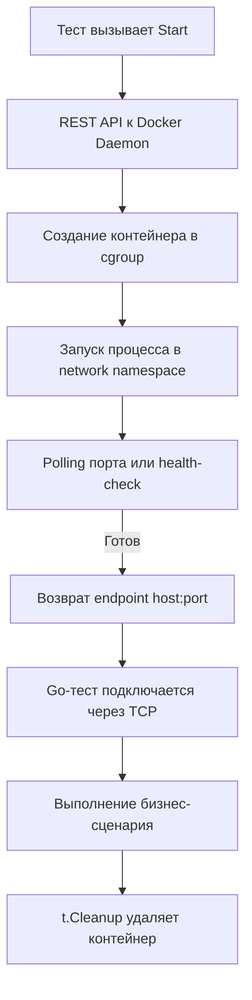

## Философия интеграционных тестов

Юнит-тесты проверяют изолированную логику, но они слепы к реальности драйверов БД, сериализаторов, сетевых таймаутов и поведения транзакций. Интеграционные тесты закрывают этот пробел, запуская код в среде, максимально приближенной к production. В Go это не означает поднятие моков или эмуляторов. Это прямое взаимодействие с реальными сервисами через Docker, что позволяет обнаружить проблемы на уровне протоколов, пулов соединений и согласованности данных до деплоя.

Главный принцип: **интеграционный тест должен быть детерминированным, изолированным и полностью очищаемым после завершения**. Любое остаточное состояние ломает параллельное исполнение и делает пайплайн непредсказуемым.

### Под капотом. Архитектура testcontainers и сетевой стек

Стандарт де-факто в экосистеме — `github.com/testcontainers/testcontainers-go`. Библиотека не эмулирует сервисы, а управляет жизненным циклом реальных Docker-контейнеров через Unix-сокет демона (`/var/run/docker.sock`).

При вызове `Start()` происходит:
1. **REST-запрос к Docker Daemon**: Отправка `POST /containers/create` с образом, портами, переменными окружения и сетевыми настройками.
2. **Запуск процесса в cgroup**: Ядро изолирует PID, память и CPU. Контейнер стартует в собственной network namespace (обычно bridge).
3. **Polling readiness**: Клиент опрашивает порт или выполняет health-check команду до тех пор, пока сервис не ответит. Используется экспоненциальный backoff.
4. **Проброс порта в host**: Docker маппит внутренний порт на случайный порт хоста (`127.0.0.1:<random>`), чтобы Go-тест мог подключиться без правки `/etc/hosts`.



> [!info] Под капотом
> Сетевая задержка между хостом и контейнером в bridge-режиме включает прохождение через `veth` пару, NAT и iptables правила. Это добавляет ~0.1-0.3 мс к каждому TCP-пакету. Для интеграционных тестов это приемлемо, но критично при замере p99 latency. В CI-средах с высокой нагрузкой тысячи одновременных `veth` пар создают contention на уровне ядра и могут исчерпать `ulimit -n` (файловые дескрипторы) на раннере.

### Идиоматичный паттерн: Изоляция, миграции и t.Cleanup

Вместо `defer` для очистки ресурсов в тестах используется `t.Cleanup()`. Он гарантирует выполнение даже при `t.Fatal()`, панике или прерывании контекста, что критично для предотвращения "зомби-контейнеров" в CI.

```go
package integration

import (
    "context"
    "database/sql"
    "fmt"
    "testing"
    "time"

    "github.com/testcontainers/testcontainers-go"
    "github.com/testcontainers/testcontainers-go/wait"
    _ "github.com/jackc/pgx/v5/stdlib"
)

func TestPostgresIntegration(t *testing.T) {
    ctx, cancel := context.WithTimeout(context.Background(), 2*time.Minute)
    defer cancel()

    // Запуск контейнера
    req := testcontainers.ContainerRequest{
        Image:        "postgres:15-alpine",
        ExposedPorts: []string{"5432/tcp"},
        Env:          map[string]string{"POSTGRES_PASSWORD": "test"},
        WaitingFor:   wait.ForLog("database system is ready to accept connections"),
    }

    pgContainer, err := testcontainers.GenericContainer(ctx, testcontainers.GenericContainerRequest{
        ContainerRequest: req,
        Started:          true,
    })
    if err != nil {
        t.Fatalf("failed to start postgres container: %v", err)
    }
    
    // Гарантированная очистка
    t.Cleanup(func() {
        _ = pgContainer.Terminate(context.Background())
    })

    host, err := pgContainer.Host(ctx)
    if err != nil {
        t.Fatalf("failed to get host: %v", err)
    }
    port, err := pgContainer.MappedPort(ctx, "5432")
    if err != nil {
        t.Fatalf("failed to get mapped port: %v", err)
    }

    dsn := fmt.Sprintf("postgres://postgres:test@%s:%s/postgres?sslmode=disable", host, port.Port())
    
    // Подключение и применение миграций
    db, err := sql.Open("pgx", dsn)
    if err != nil {
        t.Fatalf("failed to connect: %v", err)
    }
    defer db.Close()

    if err := applyMigrations(ctx, db); err != nil {
        t.Fatalf("failed to apply migrations: %v", err)
    }

    // Выполнение теста
    testUserRepository(ctx, t, db)
}
```

> [!warning] Ловушка / Gotcha
> **Общее состояние БД**: Если несколько тестов пишут в одну базу без изоляции, они начнут конфликтовать. Используйте уникальные схемы (`CREATE SCHEMA test_${rand}`) или отдельные БД на каждый тест. В Postgres это делается через `SET search_path`, в MySQL — через создание временной базы. Никогда не полагайтесь на `TRUNCATE` внутри теста: это медленно, не очищает последовательности и может вызвать блокировки таблиц.

### Параллелизм и контроль ресурсов

` t.Parallel()` в интеграционных тестах — мощный инструмент ускорения, но он требует жесткого контроля за пулом контейнеров и соединениями.

```go
func TestRepositoryParallel(t *testing.T) {
    tests := []struct {
        name  string
        setup func(*testing.T, *sql.DB)
    }{
        {"create user", setupCreateUser},
        {"update status", setupUpdateStatus},
    }

    for _, tt := range tests {
        t.Run(tt.name, func(t *testing.T) {
            t.Parallel()
            // Каждый тест получает свой контейнер или изолированную схему
            runIntegrationTest(t, tt.setup)
        })
    }
}
```

Для снижения накладных расходов на запуск контейнеров в CI применяют **переиспользование на уровне пакета** с `sync.Once` или пул семафоров. Однако это требует строгой изоляции данных, иначе тесты станут невоспроизводимыми.

### Механика исполнения и Mechanical Sympathy

Интеграционные тесты генерируют измеримое давление на систему:
- **Аллокации и GC**: Загрузка образов, чтение слоев из кэша, десериализация JSON-ответов от Docker API создают временные объекты в куче. При тысячах тестов это триггерит сборку мусора, увеличивая общее время исполнения.
- **Системные вызовы**: Каждый `sql.Open` + `db.Ping()` вызывает `socket()`, `connect()`, TCP handshake и TLS-рукопожатие (если включено). В тестах это повторяется сотни раз. Использование пула соединений с `MaxOpenConns: 5` и `ConnMaxLifetime: 1m` снижает churn сокетов.
- **Планировщик и `sync.Mutex`**: `testcontainers` использует внутренние мьютексы для синхронизации запросов к Docker API. При параллельном запуске 50+ тестов возникает contention. Ограничение `t.Parallel()` через `testing.M` или внешние семафоры (`golang.org/x/sync/semaphore`) стабилизирует пайплайн.
- **Файловые дескрипторы**: Каждый контейнер открывает ~10-20 FD для логов, сокетов и метрик. На CI-раннере с лимитом `1024` параллельные тесты быстро упираются в `too many open files`. Настройка `ulimit -n 4096` обязательна.

> [!tip] Собеседование
> **Вопрос:** Почему `defer container.Terminate()` хуже, чем `t.Cleanup()`?
> **Ответ:** `defer` выполняется при выходе из функции, но если тест падает по `t.Fatal()` внутри вложенной функции или паникует, `defer` может не сработать корректно в зависимости от контекста отмены. `t.Cleanup()` регистрируется в рантайме `testing` и гарантированно вызывается после завершения теста, независимо от способа завершения. Это предотвращает накопление "зомби-контейнеров" в CI.
> 
> **Вопрос:** Как ускорить интеграционные тесты в CI без потери надежности?
> **Ответ:** 1. Кешировать Docker-образы на раннере. 2. Переиспользовать один контейнер БД на пакет тестов с изоляцией по схемам. 3. Отключать журналы транзакций (`wal_level = minimal` для Postgres) в тестовом профиле. 4. Использовать `pgbouncer` или `connection pool` для тестовых клиентов. 5. Запускать тяжелые тесты последовательно, а легкие параллельно через `t.Parallel()`.

### Ловушки production-тестирования

- **Жестко заданные таймауты**: Контейнер на CI-машине стартует в 2-5 раз дольше, чем на локальном ноутбуке с SSD. Использование `context.WithTimeout(ctx, 30s)` для старта БД — верный путь к flaky-тестам. Устанавливайте `2-3 минуты` или используйте динамический backoff.
- **Тестирование драйверов вместо логики**: Если тест просто проверяет `db.Exec("INSERT...")` и `db.Query("SELECT...")`, он тестирует драйвер БД, а не ваш код. Интеграционный тест должен проверять бизнес-сценарий из статьи [[22. Repository pattern]]: транзакции, блокировки, маппинг структур, обработку `sql.ErrNoRows`.
- **Игнорирование `GRACEFUL SHUTDOWN`**: При `Terminate()` контейнер получает `SIGTERM`. Если ваша тестовая логика не дожидается завершения транзакций, данные могут остаться в несогласованном состоянии. Всегда дожидайтесь `WAITFOR` или используйте `force` только после проверок.
- **Зависимость от `localhost`**: В GitHub Actions или GitLab CI Docker может работать в rootless-режиме или через `docker-in-docker`. `Host()` может возвращать не `127.0.0.1`, а внутренний IP сети. Всегда используйте методы `testcontainers` для получения endpoint, а не хардкод.

### Итог

1. Интеграционные тесты проверяют контракты между компонентами, а не изолированную логику. Они обязательны для проверки драйверов, транзакций и сетевых стеков.
2. `testcontainers-go` — стандарт для запуска реальных зависимостей. Используйте `t.Cleanup()` для гарантированной очистки ресурсов.
3. Изолируйте состояние через уникальные схемы или БД, избегайте `TRUNCATE` в конкурентной среде.
4. Контролируйте параллелизм: используйте семафоры, лимитируйте количество контейнеров, настраивайте `ulimit` в CI.
5. Оптимизируйте запуск: кешируйте образы, переиспользуйте контейнеры на уровне пакетов, настраивайте пулы соединений.
6. Тестируйте бизнес-сценарии, а не базовые CRUD-операции драйверов. Фокус на транзакции, маппинг, обработку ошибок и согласованность данных.

Правильно настроенные интеграционные тесты превращают пайплайн из источника нестабильности в надежный фильтр, который отлавливает рассинхронизацию контрактов и проблемы инфраструктуры до попадания кода в production.

Следующая статья: [[36. Load testing]]