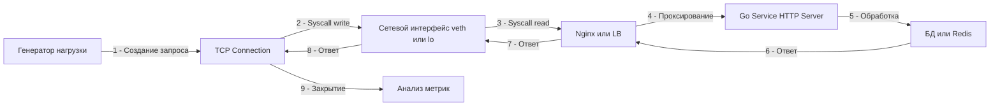

## Философия нагрузочного тестирования

Нагрузочное тестирование (Load Testing) — это не просто проверка того, «выдержит ли сервис 1000 запросов в секунду». Это процесс валидации архитектурных решений, настройки таймаутов и понимания пределов масштабирования системы. В отличие от профилирования (`pprof`), которое отвечает на вопрос «почему этот запрос медленный?», нагрузочное тестирование отвечает на вопрос «что произойдет, когда запросов станет слишком много?».

В Go-экосистеме, благодаря высокой производительности стандартной библиотеки, сервисы часто упираются не в CPU, а в лимиты ОС (файловые дескрипторы), внешние зависимости (БД, очереди) или задержки сборки мусора (GC) при экстремальных аллокациях. Правильно выстроенное тестирование моделирует реальную картину трафика, позволяя найти точки разлома до продакшена.

1. Математика и ключевые метрики

Для понимания результатов необходимо опираться на закон Литтла и статистические процентилями:

- **RPS (Requests Per Second)**: Количество обрабатываемых запросов в единицу времени.
- **Throughput (Пропускная способность)**: Объем данных, передаваемых за единицу времени (Мбит/с).
- **Latency (Задержка)**: Время от отправки запроса до получения полного ответа.
- **Percentiles (p50, p95, p99)**: Среднее время ответа бессмысленно. Если 99 запросов ответили за 10 мс, а 1 — за 10 секунд, среднее будет ~200 мс, но пользовательский опыт сломан. Нам важен **p99** (время, быстрее которого ответили 99% запросов).
- **Закон Литтла**: $L = \lambda W$ (Количество запросов в системе = Прибытие запросов * Время обработки). Если время обработки ($W$) растет из-за конкуренции за ресурсы, количество активных горутин ($L$) растет, пока не упрется в память.

2. Инструментарий: k6 vs wrk vs Vegeta

Выбор инструмента зависит от сценария.

- **wrk / wrk2**: Написан на C, использует `epoll` для генерации огромного трафика с одной машины. Идеален для стресс-теста «железа» и бенчмаркинга HTTP-серверов. Не гибок в логике (сложно менять payload).
- **k6**: Современный стандарт. Написан на Go, сценарии на JS. Умеет эмулировать реалистичное поведение пользователей, работать с переменными, проверять ответы. Легко интегрируется в CI/CD.
- **Vegeta**: Специализирован на постоянную скорость атаки (Constant Rate). Полезен для поиска пределов пропускной способности без учета задержек ответа.



3. Под капотом. Генерация трафика и сетевой стек

Когда инструмент вроде `k6` или `wrk` генерирует нагрузку, он становится клиентом. На уровне ОС происходят следующие процессы:

- **Файловые дескрипторы**: Каждое активное соединение потребляет 1 дескриптор (сокет). Если тест требует 10 000 одновременных соединений, `ulimit -n` на машине-генераторе и на машине-сервере должен быть > 10 000.
- **Ephemeral Ports**: Для исходящих соединений ОС использует пул эфемерных портов (обычно 32768–60999). Это всего ~28 000 портов. Если вы хотите создать больше соединений к одному серверу, вы упретесь в лимит портов, даже если `ulimit` бесконечен. Решение: использовать несколько IP-адресов на клиенте или переиспользовать соединения (Keep-Alive).
- **TCP TIME_WAIT**: После закрытия соединения сокет висит в состоянии `TIME_WAIT` (обычно 60 секунд). При коротких тестах с частым открытием/закрытием соединений машина может быстро исчерпать ресурсы. В тестах всегда используйте `Connection: Keep-Alive`.

> [!info] Под капотом
> В Linux при высокой нагрузке на один процесс `epoll` эффективен, но при очень частых переключениях контекста между горутинами генератора и обработчика может возникать `lock contention`. Для достижения миллионов RPS часто используют `SO_REUSEPORT` и запускают несколько процессов-генераторов, привязанных к разным ядрам (CPU Affinity), чтобы избежать миграции потоков ОС между ядрами.

4. Идиоматичная подготовка сервиса к тесту

Нельзя тестировать сервис, собранный с флагом `-gcflags="-m"`, включенными дебаг-логами и `pprof` эндпоинтами. Для нагрузочного теста собирайте бинарник в режиме `release`:

```bash
# Очистка кэша сборки
go clean -cache

# Компиляция без отладочной информации, с оптимизациями
go build -ldflags="-s -w" -o ./service-bin ./cmd/main.go
```

Важно настроить `GOGC` и `GOMEMLIMIT` перед тестом, чтобы понять поведение сборщика мусора под нагрузкой:

```bash
# Уменьшение частоты сборки мусора для повышения пропускной способности (риск роста памяти)
export GOGC=100 
# Или жесткий лимит памяти
export GOMEMLIMIT=512MiB
```

5. Сценарии тестирования

- **Smoke Test**: Низкая нагрузка (5-10 RPS). Проверка, что сервис вообще запускается, конфиги верны, БД доступна.
- **Load Test**: Постепенное увеличение нагрузки до целевого уровня (например, 1000 RPS). Проверка стабильности метрик (p99 < 200ms).
- **Stress Test**: Нагрузка выше целевой (2000-5000 RPS). Цель: найти точку поломки (когда начнутся 500-е ошибки, утечки памяти или зависания).
- **Soak Test (Endurance)**: Средняя нагрузка на длительное время (12-24 часа). Цель: найти утечки памяти (Memory Leaks) и фрагментацию кучи, которые не видны за 5 минут теста.

6. Анализ результатов и узкие места в Go

Если при тесте вы видите рост времени ответа (Latency), проверьте следующие точки:

- **CPU Saturation**: Если `top` показывает 100% CPU (user), значит, алгоритмическая сложность высока или слишком много горутин.
- **GC Pressure**: Если `top` показывает высокий `sys` CPU и паузы в логах, значит, аллоцируется слишком много мусора. Смотрите `go tool pprof -allocs`.
- **Mutex Contention**: Если CPU низкий, но latency растет, возможно, горутины стоят в очереди на мьютекс. Профилировщик `pprof -block` покажет, где ожидание.
- **Connection Pool Exhaustion**: Проверьте метрики пула соединений к БД (`db_connections_in_use`). Если пул заполнен, запросы встают в очередь на уровне `database/sql`.

> [!warning] Ловушка / Gotcha
> **Тестирование с localhost**: Запуск генератора и сервера на одной машине искажает результаты. Они делят один CPU, одну память и один сетевой стек. Генератор будет «отбирать» ресурсы у сервера. Для достоверных данных запускайте генератор на отдельной машине в том же дата-центре (одной зоне доступности).
> **Эффект разогрева (Warm-up)**: Первый запрос к Go-сервису может быть медленным из-за ленивой инициализации (первый вызов `regexp.Compile`, инициализация монотонного таймера). Всегда давайте сервису 10-30 секунд на разогрев перед началом замеров метрик.

7. Интеграция в CI/CD

Нагрузочное тестирование должно быть автоматизированным этапом пайплайна. Пример сценария для `k6` (`script.js`):

```javascript
import http from 'k6/http';
import { check, sleep } from 'k6';

export const options = {
  stages: [
    { duration: '30s', target: 100 },  // Ramp-up
    { duration: '1m', target: 100 },   // Plateau
    { duration: '30s', target: 0 },    // Ramp-down
  ],
  thresholds: {
    http_req_duration: ['p(95)<200'], // p95 должен быть меньше 200мс
    http_req_failed: ['rate<0.01'],   // Менее 1% ошибок
  },
};

export default function () {
  const res = http.get('http://target-service:8080/api/health');
  check(res, {
    'status is 200': (r) => r.status === 200,
  });
  sleep(1);
}
```
Запуск в CI: `k6 run --out json=results.json script.js`. Если пороги не пройдены — пайплайн падает (красный статус).

> [!tip] Собеседование
> **Вопрос:** Как эмулировать медленного клиента в нагрузочном тесте?
> **Ответ:** Обычные инструменты читают ответ максимально быстро. Чтобы проверить поведение сервера при медленных клиентах (атака Slowloris), нужно использовать инструменты, которые читают тело ответа по одному байту с задержкой. Это проверяет, не держит ли сервер горутины открытыми слишком долго. В Go для защиты от этого используются `ReadTimeout` и `WriteTimeout` в `http.Server`.
> 
> **Вопрос:** Что важнее: пропускная способность или задержка?
> **Ответ:** Обычно приоритет — задержка (Latency). Пользователь не заметит, если сервис обрабатывает 1000 RPS или 2000 RPS, но он заметит, если страница грузится 5 секунд вместо 0.5. Оптимизация под p99 важнее, чем гонка за максимальным RPS.

8. Итог

9. Нагрузочное тестирование выявляет архитектурные проблемы, которые не видны на юнит-тестах.
10. Используйте `k6` для функциональной проверки нагрузки, `wrk` для стресс-теста железа.
11. Всегда анализируйте перцентили (p95, p99), среднее время ответа скрывает проблемы.
12. Запускайте генератор нагрузки на отдельном сервере, чтобы избежать конкуренции за ресурсы.
13. Контролируйте лимиты ОС (`ulimit -n`, порты) и пулы соединений.
14. Интегрируйте автоматические пороги (thresholds) в CI/CD для регрессионного контроля производительности.
15. Не забывайте про Soak-тесты для поиска утечек памяти при длительной работе.

Следующая статья: [[37. Dockerization сервиса]]