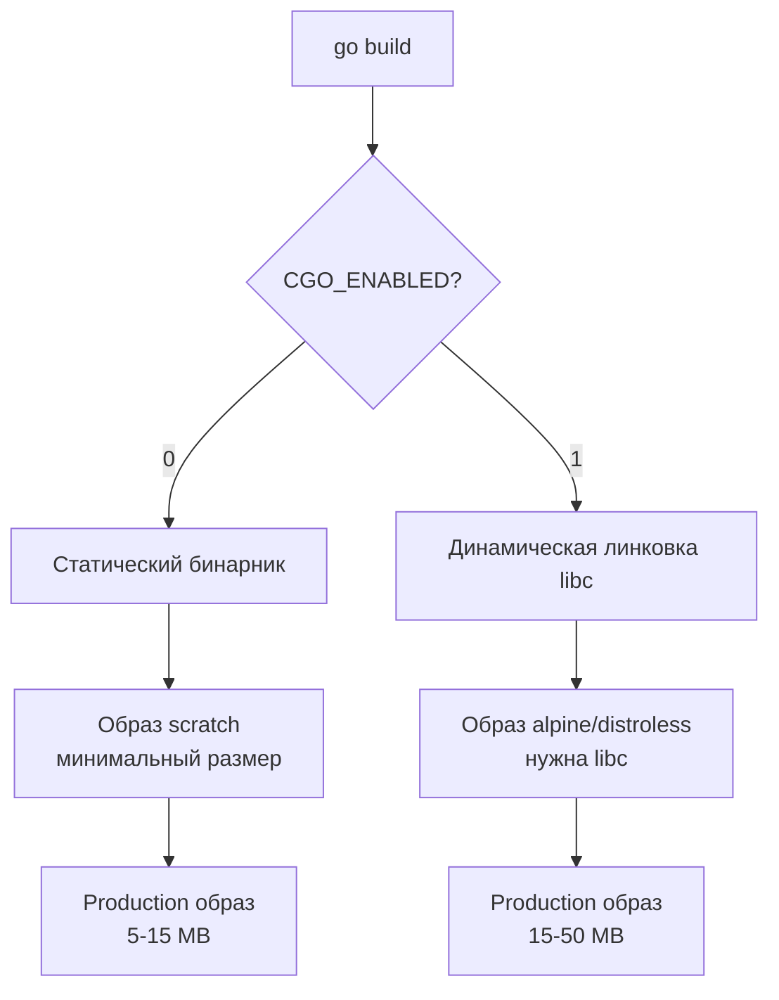

## Философия контейнеризации Go-сервисов

Docker в Go-экосистеме — это не просто способ упаковать бинарник. Это архитектурный инструмент, который позволяет создавать минималистичные, безопасные и переносимые образы с предсказуемым поведением. В отличие от PHP или Python, где образ содержит интерпретатор и тысячи зависимостей, Go компилируется в статический бинарник, что открывает уникальные возможности для оптимизации размера и безопасности.

Правильно собранный Docker-образ Go-сервиса может занимать менее 10 МБ, запускаться за миллисекунды и иметь минимальную поверхность для атак. Но для этого нужно понимать, как работает компоновка (linking), что попадает в бинарник и как минимизировать слои.

### 1. Multi-stage builds: разделение сборки и рантайма

Go позволяет разделить процесс на две независимые стадии: компиляцию (с тяжелым инструментарием) и исполнение (минималистичный рантайм).

```dockerfile
# Stage 1: Build
FROM golang:1.21-alpine AS builder

WORKDIR /app

# Копируем только go.mod и go.sum для кеширования зависимостей
COPY go.mod go.sum ./
RUN go mod download

# Копируем исходный код
COPY . .

# Собираем статический бинарник
# -ldflags="-s -w" удаляет символы отладки и таблицу символов
# CGO_ENABLED=0 отключает CGO для полной статической линковки
RUN CGO_ENABLED=0 GOOS=linux GOARCH=amd64 go build \
    -ldflags="-s -w -buildid=" \
    -a -installsuffix cgo \
    -o server ./cmd/main.go

# Stage 2: Runtime
FROM scratch

# Копируем CA-сертификаты для HTTPS запросов
COPY --from=builder /etc/ssl/certs/ca-certificates.crt /etc/ssl/certs/

# Копируем бинарник
COPY --from=builder /app/server /server

# Создаем не-root пользователя (для scratch это просто метаданные)
# В реальности нужно использовать useradd в промежуточном образе
USER nobody

ENTRYPOINT ["/server"]
```

> [!info] Под капотом
> Флаг `-buildid=` удаляет build ID из бинарника, что делает сборку детерминированной (reproducible build). Флаг `-a` форсирует пересборку всех пакетов, игнорируя кеширование, что гарантирует полную статическую линковку. `CGO_ENABLED=0` отключает динамическую линковку с libc, что позволяет использовать образ `scratch` (пустой образ без файлов). Размер такого бинарника обычно 5-15 МБ.

### 2. Выбор базового образа: Scratch vs Alpine vs Distroless

Выбор образа влияет на размер, безопасность и отладку.

| Образ | Размер | Безопасность | Отладка | CGO | Use Case |
|---|---|---|---|---|---|
| **scratch** | 0 Б + бинарник | Максимальная | Невозможна | Нет | Статические бинарники, максимальная минимизация |
| **alpine** | ~5 МБ | Высокая | Возможна (apk add) | Да | Сервисы с CGO, нужны базовые утилиты |
| **distroless** | ~2-10 МБ | Очень высокая | Ограничена | Нет | Production, баланс безопасности и функциональности |
| **debian-slim** | ~80 МБ | Средняя | Полная | Да | Legacy, сложные зависимости |



**Distroless** образы от Google — золотая середина. Они содержат только рантайм-зависимости (libc, ca-certificates, tzdata), но не содержат shell, package manager или отладочных инструментов.

```dockerfile
# Для Go с CGO
FROM gcr.io/distroless/base-debian12

# Для чистого Go (без CGO)
FROM gcr.io/distroless/static-debian12

COPY server /server
USER 65532
ENTRYPOINT ["/server"]
```

### 3. Оптимизация слоев и кеширование

Docker кеширует слои. Неправильный порядок инструкций приводит к пересборке всего образа при изменении одного файла.

**Антипаттерн:**
```dockerfile
COPY . .
RUN go mod download
```
При изменении любого файла `.go` слой `COPY . .` инвалидируется, и `go mod download` выполняется заново.

**Правильный порядок:**
```dockerfile
# Сначала копируем метаданные зависимостей
COPY go.mod go.sum ./
RUN go mod download

# Потом исходный код
COPY . .
RUN go build ...
```

Теперь при изменении кода `go mod download` берется из кеша.

> [!warning] Ловушка / Gotcha
> **Временные файлы в одном слое**: Если вы делаете `RUN apt-get update && apt-get install ...`, кеш слоя содержит кеш apt. Это раздувает образ. Всегда очищайте кеш в том же слое: `RUN apt-get update && apt-get install -y ... && rm -rf /var/lib/apt/lists/*`.
> **Многослойность**: Каждая инструкция `RUN`, `COPY`, `ADD` создает новый слой. Для минимизации слоев объединяйте команды через `&&` и используйте multi-stage builds.

### 4. Безопасность: Non-root пользователь и Read-only FS

Запуск от root в контейнере — критическая уязвимость. Если злоумышленник выйдет из контейнера (container escape), он получит root-доступ на хосте.

```dockerfile
# Создаем пользователя в builder
FROM golang:1.21-alpine AS builder
RUN adduser -D -g '' appuser

# ... сборка ...

# Копируем с правильными правами
FROM scratch
COPY --from=builder /etc/passwd /etc/passwd
COPY --from=builder /app/server /server
USER appuser
ENTRYPOINT ["/server"]
```

Для `distroless` используйте UID напрямую:
```dockerfile
USER 65532:65532
```

**Read-only файловая система**:
В Kubernetes добавьте `securityContext.readOnlyRootFilesystem: true`. Сервис не сможет записать ничего на диск, что предотвратит атаки через запись вредоносных файлов. Для логов используйте stdout/stderr, для временных файлов — `emptyDir` volume.

### 5. Health checks и graceful shutdown

Docker и Kubernetes нуждаются в способе проверить, жив ли сервис.

```dockerfile
HEALTHCHECK --interval=30s --timeout=3s --start-period=5s --retries=3 \
    CMD wget --no-verbose --tries=1 --spider http://localhost:8080/health || exit 1
```

Но лучше использовать exec-проверку, если бинарник поддерживает:
```dockerfile
HEALTHCHECK CMD ["/server", "healthcheck"]
```

**Graceful shutdown**: При `docker stop` или `kubectl delete pod` контейнер получает `SIGTERM`. Go-сервис должен:
1. Перестать принимать новые соединения
2. Дождаться завершения активных запросов (с таймаутом)
3. Закрыть соединения с БД
4. Выйти с кодом 0

```go
func main() {
    server := &http.Server{Addr: ":8080", Handler: mux}
    
    go func() {
        if err := server.ListenAndServe(); err != nil && err != http.ErrServerClosed {
            log.Fatal(err)
        }
    }()
    
    quit := make(chan os.Signal, 1)
    signal.Notify(quit, syscall.SIGTERM, syscall.SIGINT)
    <-quit
    
    ctx, cancel := context.WithTimeout(context.Background(), 30*time.Second)
    defer cancel()
    
    if err := server.Shutdown(ctx); err != nil {
        log.Fatalf("shutdown error: %v", err)
    }
}
```

> [!tip] Собеседование
> **Вопрос:** Почему `docker stop` ждет 10 секунд перед `SIGKILL`?
> **Ответ:** Это `--stop-timeout` по умолчанию. За это время приложение должно корректно завершиться, обработав `SIGTERM`. Если процесс игнорирует сигнал или не завершается, Docker отправляет `SIGKILL` (неперехватываемый). В Kubernetes `terminationGracePeriodSeconds` по умолчанию 30 секунд. Убедитесь, что ваш graceful shutdown укладывается в этот лимит.
> 
> **Вопрос:** Зачем нужен `tini` или `dumb-init` в Go-образах?
> **Ответ:** Если Go-сервис запускает дочерние процессы (через `exec.Command`), они становятся зомби (zombie processes), так как Go не является init-системой и не собирает их. `tini` решает эту проблему. Для чистого HTTP-сервиса без дочерних процессов `tini` не нужен.

### 6. Отладка и observability в production

Минималистичные образы (`scratch`, `distroless`) не содержат shell, что усложняет отладку.

**Стратегии:**
1. **Debug-образ**: Создайте отдельный target с отладочными символами и shell.
```dockerfile
FROM golang:1.21-alpine AS debug
RUN go install github.com/go-delve/delve/cmd/dlv@latest
COPY server /server
ENTRYPOINT ["/go/bin/dlv", "exec", "/server"]
```

2. **Ephemeral debug container** (Kubernetes 1.20+):
```bash
kubectl debug my-pod -it --image=busybox --target=my-container
```

3. **Remote debugging**: Пробросьте порт 40000 для Delve.
```dockerfile
EXPOSE 40000
CMD ["dlv", "--listen=:40000", "--headless=true", "--api-version=2", "exec", "/server"]
```

### 7. Ловушки и антипаттерны

- **Игнорирование `.dockerignore`**: Без него `COPY . .` копирует `.git`, `vendor`, `bin`, что раздувает контекст сборки и замедляет билд.
```dockerignore
.git
vendor
bin
*.md
Dockerfile*
docker-compose*
```

- **Динамические зависимости в статическом бинарнике**: Если вы забыли `CGO_ENABLED=0`, бинарник будет линковаться с `libc`. При копировании в `scratch` он не запустится с ошибкой `standard_init_linux.go:219: exec user process caused: no such file or directory`.

- **Часовой пояс**: Образ `scratch` не содержит `/usr/share/zoneinfo`. Время будет UTC, но если вам нужен другой TZ, копируйте файл:
```dockerfile
COPY --from=builder /usr/share/zoneinfo/Europe/Moscow /etc/localtime
```

- **CA-сертификаты**: Без `ca-certificates.crt` HTTPS запросы из Go-сервиса будут падать с `x509: certificate signed by unknown authority`.

### 8. Итог

1. Используйте multi-stage builds для разделения сборки и рантайма.
2. Предпочитайте `scratch` или `distroless` для production, `alpine` для отладки.
3. Собирайте с `CGO_ENABLED=0` и `-ldflags="-s -w"` для минимального размера.
4. Кешируйте зависимости через правильный порядок `COPY go.mod` перед `COPY . .`.
5. Запускайте от non-root пользователя с read-only файловой системой.
6. Реализуйте graceful shutdown с обработкой `SIGTERM` и таймаутом.
7. Используйте `.dockerignore` для ускорения сборки и уменьшения контекста.
8. Для отладки создавайте отдельные debug-образы или используйте ephemeral containers.

Правильно собранный Docker-образ Go-сервиса — это баланс между минимализмом, безопасностью и удобством поддержки.

Следующая статья: [[38. Конфигурация nginx]]