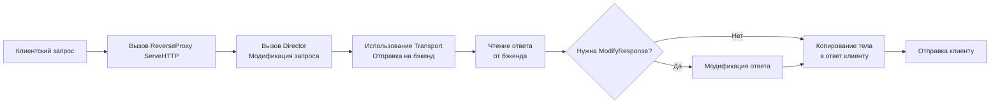

## Архитектура Reverse Proxy в Go

Reverse Proxy (Обратный прокси-сервер) — это архитектурный паттерн, при котором сервер выступает посредником, принимая запросы от клиентов и перенаправляя их на внутренние сервисы (Backends). В контексте Go это часто реализуется через паттерн **API Gateway** или **BFF** (Backend for Frontend).

Хотя Nginx или Envoy являются стандартами для edge-проксирования, Go предоставляет мощный стандартный пакет `net/http/httputil`, позволяющий создавать высокопроизводительные прокси-серверы прямо в коде. Это дает полный контроль над маршрутизацией, мутацией запросов и логикой балансировки без зависимости от внешней инфраструктуры.

### 1. Внутреннее устройство `httputil.ReverseProxy`

Структура `ReverseProxy` — это не просто пересылка байтов. Это конвейер, состоящий из трех ключевых компонентов:
1. **Director**: Функция-модификатор запроса. Выполняется синхронно в горутине. Отвечает за подмену URL, добавление заголовков и выбор целевого бэкенда.
2. **Transport**: Реализация `http.RoundTripper`. Отвечает за пул соединений, TLS, таймауты и непосредственную отправку запроса на бэкенд.
3. **ModifyResponse** (опционально): Функция для изменения ответа от бэкенда перед отправкой клиенту.



> [!info] Под капотом
> `ReverseProxy` использует `io.Copy` для потоковой передачи тела запроса и ответа. Это означает, что данные не буферизуются полностью в памяти (за исключением случаев, когда требуется сжатие или трансформация). `FlushInterval` контролирует частоту сброса буфера. По умолчанию он равен 0 (ожидание заполнения буфера или завершения чтения), но для Server-Sent Events или WebSockets его следует устанавливать в `-1` (принудительный flush после каждой записи).

### 2. Идиоматичная реализация прокси

Создание простого прокси требует аккуратной настройки `Director`. Самая частая ошибка — неправильная склейка путей (`SingleJoiningSlash`).

```go
package main

import (
    "net/http"
    "net/http/httputil"
    "net/url"
)

func NewSimpleProxy(targetURL string) (*httputil.ReverseProxy, error) {
    target, err := url.Parse(targetURL)
    if err != nil {
        return nil, err
    }

    proxy := httputil.NewSingleHostReverseProxy(target)
    
    // Кастомизация Director
    originalDirector := proxy.Director
    proxy.Director = func(req *http.Request) {
        originalDirector(req)
        
        // Пример: добавление кастомного заголовка
        req.Header.Set("X-Proxy-By", "go-service")
        
        // Важно: X-Forwarded-For добавляется автоматически в Go 1.20+,
        // но для старых версий нужно делать вручную:
        // req.Header.Set("X-Forwarded-For", req.RemoteAddr)
    }

    // Настройка Transport для управления пулом соединений
    proxy.Transport = &http.Transport{
        MaxIdleConns:          100,
        IdleConnTimeout:       90 * time.Second,
        TLSHandshakeTimeout:   10 * time.Second,
        ExpectContinueTimeout: 1 * time.Second,
    }

    return proxy, nil
}
```

> [!warning] Ловушка / Gotcha
> **Утечка `X-Forwarded-For`**: При использовании `NewSingleHostReverseProxy` заголовок `X-Forwarded-For` добавляется автоматически. Однако, если вы модифицируете `req.URL` вручную внутри `Director`, убедитесь, что вы не ломаете логику проксирования. Никогда не модифицируйте `req.Host` без необходимости, так как это может сломать виртуальный хостинг на бэкенде.

### 3. Реализация Load Balancer (Балансировщика)

Для распределения нагрузки между несколькими бэкендами `Director` должен динамически выбирать целевой URL. Простейший алгоритм — Round Robin.

```go
package main

import (
    "math/rand"
    "net/http"
    "net/http/httputil"
    "net/url"
    "sync"
)

type LoadBalancer struct {
    backends []*url.URL
    current  int
    mu       sync.Mutex // Для потокобезопасности counter
}

func (lb *LoadBalancer) GetNext() *url.URL {
    lb.mu.Lock()
    defer lb.mu.Unlock()
    
    // Простой Round Robin
    next := lb.backends[lb.current]
    lb.current = (lb.current + 1) % len(lb.backends)
    return next
}

func NewLoadBalancerProxy(backends []*url.URL) *httputil.ReverseProxy {
    lb := &LoadBalancer{backends: backends}

    return &httputil.ReverseProxy{
        Director: func(req *http.Request) {
            target := lb.GetNext()
            
            req.URL.Scheme = target.Scheme
            req.URL.Host = target.Host
            req.Host = target.Host // Важно для виртуальных хостов
            
            // Сохраняем оригинальный путь
            // req.URL.Path остается без изменений
        },
        ErrorHandler: func(w http.ResponseWriter, r *http.Request, err error) {
            // Кастомная обработка ошибок (например, 502 Bad Gateway)
            w.WriteHeader(http.StatusBadGateway)
            w.Write([]byte("Backend unavailable"))
        },
    }
}
```

### 4. Механика ошибок и повторных попыток (Retries)

Стандартный `ReverseProxy` не умеет делать ретраи на другие бэкенды при ошибке. Если выбранный сервер упал, клиент получит 502. Для production-решений нужно оборачивать `RoundTrip`.

```go
type RetryTransport struct {
    Base http.RoundTripper
    MaxRetries int
}

func (t *RetryTransport) RoundTrip(req *http.Request) (*http.Response, error) {
    attempts := 0
    
    for {
        resp, err := t.Base.RoundTrip(req)
        if err == nil {
            return resp, nil // Успех
        }
        
        attempts++
        if attempts >= t.MaxRetries {
            return nil, err // Исчерпали попытки
        }
        
        // Логирование ошибки и продолжение цикла
        // Важно: req.Body уже прочитан в первый раз? 
        // Если нет, можно переиспользовать. Если да, нужно клонировать Body.
        // httputil.ReverseProxy обычно читает тело, поэтому ретрай сложен без клонирования.
    }
}
```

> [!tip] Собеседование
> **Вопрос:** В чем проблема с ретраями POST-запросов в Reverse Proxy?
> **Ответ:** Тело POST-запроса (`io.ReadCloser`) может быть прочитано только один раз. При первой попытке отправки `Transport` читает тело. Если происходит ошибка и нужен ретрай, тело уже пустое. Решение: перед отправкой обернуть `req.Body` в `io.NopCloser` после чтения в буфер, или использовать `req.GetBody()` (если функция определена), чтобы создать новый `io.ReadCloser` для каждой попытки.

### 5. Производительность и Mechanical Sympathy

При проксировании миллионов запросов критичны следующие аспекты:

1. **Аллокации строк**: `req.URL.String()` создает новую строку в куче на каждый запрос. Внутри `Director` работайте с полями структуры напрямую, избегайте сериализации URL.
2. **Буферизация заголовков**: `http.Header` — это `map[string][]string`. При пробросе заголовков (`req.Header = backendResp.Header`) происходит поверхностное копирование. Если бэкенд модифицирует мапу, это может привести к гонкам данных. Лучше копировать нужные заголовки вручную или использовать `http.Header.Clone()`.
3. **Connection Reuse**: Убедитесь, что `Transport` используется один на все запросы, а не создается внутри `Director`. Создание нового `Transport` на каждый запрос — это создание нового пула сокетов, что ведет к `TIME_WAIT` и исчерпанию портов.
4. **Context Propagation**: `ReverseProxy` автоматически прокидывает `req.Context()` в исходящий запрос. Это гарантирует, что отмена клиента (разрыв соединения) немедленно отменит запрос к бэкенду.

### 6. Сравнение с внешними прокси

| Характеристика | Go `httputil` | Nginx | Envoy |
|---|---|---|---|
| **Латентность** | Низкая (в том же процессе) | Низкая (отдельный процесс) | Средняя (Sidecar overhead) |
| **Гибкость логики** | Полная (код на Go) | Ограничена (конфиг + Lua) | Высокая (WASM + API) |
| **Пул соединений** | Настроен программно | Tuning конфигов | Встроенная балансировка |
| **Наблюдаемость** | Via code (pprof, logs) | Access logs | Native Metrics (Prometheus) |
| **Использование RAM** | Зависит от кода | Оптимизировано | Выше (C++ runtime) |

### 7. Итог

1. `httputil.ReverseProxy` — мощный инструмент для создания API Gateway и микросервисной маршрутизации.
2. Всегда настраивайте кастомный `http.Transport` с таймаутами и лимитами соединений.
3. В `Director` модифицируйте только необходимые поля (`URL.Host`, `URL.Path`), избегайте лишних аллокаций.
4. Для WebSockets и SSE обязательно устанавливайте `FlushInterval: -1` и отключайте буферизацию.
5. Реализуйте кастомный `ErrorHandler` для возврата понятных HTTP-кодов (502, 504) вместо паники рантайма.
6. Помните о проблеме повторного чтения тела запроса при реализации ретраев.

Следующая статья: [[40. Деплой в production]]