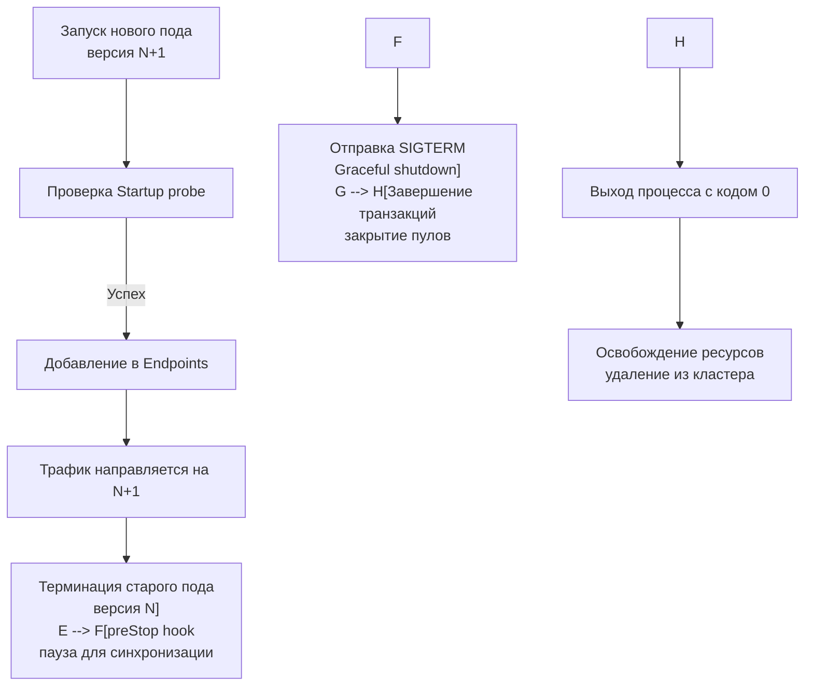

## Деплой в production. Архитектура запуска и жизненный цикл

Деплой Go-сервиса в production — это не просто `docker push` и `kubectl apply`. Это архитектурный этап, где код встречается с ограничениями ядра ОС, политикой безопасности и реальным трафиком. В отличие от интерпретируемых языков, где деплой часто сводится к замене артефактов на диске, Go требует понимания взаимодействия рантайма с cgroups, менеджерами сигналов и сетевым стеком оркестратора. Ошибки на этом этапе ведут не к `500 Internal Server Error`, а к `OOMKilled`, `CrashLoopBackOff` или незаметной деградации p99 latency.

### 1. Стратегии развертывания и влияние на рантайм

Выбор стратегии диктуется требованиями к доступности, стоимости инфраструктуры и совместимости схем БД.

- **Rolling Update**: Постепенная замена подов. Стандарт Kubernetes. Требует обратной совместимости API и схемы БД. В Go работает предсказуемо благодаря быстрому старту (<100 мс) и низкому потреблению памяти.
- **Blue-Green**: Параллельный запуск новой версии, мгновенное переключение трафика. Дает возможность быстрого отката, но удваивает потребление ресурсов. Идеально для сервисов с долгой инициализацией кэшей или тяжелыми миграциями.
- **Canary**: Постепенное перенаправление процента трафика (1% → 5% → 50% → 100%) на основе метрик. Требует интеграции с Service Mesh (Istio, Linkerd) или контроллером ингресса.

> [!info] Под капотом
> При Rolling Update оркестратор создает новый под и одновременно начинает терминировать старый. В этот момент возникает **версионный рассинхрон**: запрос от клиента v1 может попасть на сервер v2, а ответ от v2 — обработаться клиентом v1. Go-сервисы должны явно поддерживать обратную совместимость контрактов (статья [[32. API versioning]]), иначе рассинхрон приведет к `400 Bad Request` или `json.Unmarshal` ошибкам в полете.

### 2. Интеграция с оркестратором и Lifecycle хуки

Kubernetes управляет жизненным циклом пода через контейнерные хуки. Без их правильной настройки даже идеально написанный `Graceful Shutdown` (статья [[10. Graceful shutdown]]) не спасет от потери запросов.



**Критическая проблема Race Condition**: При получении `SIGTERM` Kubernetes немедленно удаляет IP пода из объекта `Endpoints` (или `EndpointSlice`). Однако обновление правил `iptables`/`ipvs` в kube-proxy занимает 1-3 секунды. Если Go-сервис начнет закрывать соединения сразу по сигналу, балансировщик все еще будет слать трафик на умирающий инстанс → `Connection Refused` или `502`.

Решение: `preStop` hook с задержкой, синхронизированной с временем обновления сетевых правил.

```yaml
lifecycle:
  preStop:
    exec:
      command: ["sleep", "5"]
terminationGracePeriodSeconds: 35
```
Эти 5 секунд дают kube-proxy время распространить новые правила, после чего Go-процесс получает `SIGTERM` и начинает детерминированный shutdown.

### 3. Tuning рантайма под cgroups

Современные оркестраторы ограничивают ресурсы через cgroups v2. Рантайм Go должен корректно интерпретировать эти лимиты, иначе произойдет OOM или троттлинг CPU.

- **Память**: С Go 1.21 рантайм автоматически читает лимит памяти из cgroups и использует его для расчета `GOMEMLIMIT`. До этого приходилось использовать `github.com/KimMachineGun/automemlimit`. `GOMEMLIMIT` задает мягкий лимит кучи, заставляя GC работать агрессивнее до достижения жесткого лимита cgroups. Это предотвращает `OOMKilled` ядром Linux, которое убивает процесс без стека вызовов.
- **CPU**: Начиная с Go 1.22, `GOMAXPROCS` автоматически подстраивается под CPU quota cgroups. Если лимит 500m (0.5 ядра), `GOMAXPROCS` станет 1. Это предотвращает создание избыточных системных тредов, которые будут конкурировать за кванты времени и увеличивать latency из-за переключений контекста.

> [!warning] Ловушка / Gotcha
> **CPU Throttling**: Установка жестких CPU limits в Kubernetes без понимания поведения планировщика Go приводит к микро-паузам. Если `CFS quota` исчерпан, ядро приостанавливает все треды процесса на остаток периода. Для latency-sensitive сервисов (платежи, трейдинг) часто лучше использовать `requests` без `limits` или настраивать `cpuManagerPolicy: static` для выделения целых ядер.

### 4. Механика сигналов и PID 1

В контейнерах первый процесс (PID 1) имеет особые обязанности: он должен перенаправлять сигналы и собирать zombie-процессы. Если вы запускаете Go-бинарник через shell-скрипт (`ENTRYPOINT ["/bin/sh", "-c", "./server"]`), сигнал `SIGTERM` получит `sh`, а не Go. `sh` по умолчанию не пересылает сигналы дочерним процессам. Сервис будет убит `SIGKILL` через `terminationGracePeriodSeconds`, не успев закрыть транзакции.

Правильный подход:
```dockerfile
# Прямой вызов бинарника
ENTRYPOINT ["/app/server"]
```
Или использование init-системы (`tini`, `dumb-init`), если требуется запуск нескольких процессов.

### 5. Безопасность и Hardening

Production-деплой требует минимальной поверхности атаки:
- **Non-root**: `securityContext.runAsUser: 65532` (nobody). Go не требует root для bind на порты > 1024 или работы с сетью.
- **Read-only FS**: `securityContext.readOnlyRootFilesystem: true`. Предотвращает запись вредоносных файлов. Для временных данных используйте `emptyDir` volumes.
- **Drop Capabilities**: `capabilities.drop: ["ALL"]`. Linux capabilities вроде `CAP_NET_ADMIN` не нужны обычному HTTP-сервису.
- **Seccomp**: Профиль `RuntimeDefault` блокирует опасные системные вызовы (`ptrace`, `mount`).

### 6. Собеседование

> [!tip] Собеседование
> **Вопрос:** В чем разница между `OOMKilled` и паникой рантайма Go? Как диагностировать?
> **Ответ:** `OOMKilled` — это действие ядра Linux (cgroup OOM killer), которое принудительно завершает процесс при превышении лимита памяти. В логах приложения не будет stack trace, только событие `Killed` или сообщение от `dmesg`. Паника рантайма (`panic`) возникает при нарушении контрактов Go (nil pointer, out of bounds, race detector) и выводит полный стек в stderr. Диагностика OOM требует анализа метрик `container_memory_working_set_bytes` и настройки `GOMEMLIMIT`.
> 
> **Вопрос:** Почему `preStop` hook необходим, если в коде есть `server.Shutdown(ctx)`?
> **Ответ:** `server.Shutdown` управляет только соединениями внутри процесса. Он не знает о сетевом стеке кластера. Kubernetes удаляет под из балансировщика асинхронно. `preStop` создает буфер времени, гарантирующий, что `iptables`/`ipvs` обновятся до того, как Go закроет слушающий сокет. Без этого возникает окно в 1-3 секунды, когда трафик идет на мертвый под.

### 7. Итог

8. Деплой — это архитектурный контракт между кодом, оркестратором и ядром ОС.
9. Используйте `preStop` hook для синхронизации с сетевым слоем кластера и избежания race condition при удалении из Endpoints.
10. С Go 1.21+ рантайм автоматически учитывает cgroups для `GOMEMLIMIT` и `GOMAXPROCS`. Не дублируйте настройки вручную.
11. Запускайте бинарник как PID 1 напрямую или через `tini`, чтобы гарантировать доставку `SIGTERM`.
12. Hardening: non-root, read-only FS, drop capabilities, seccomp default.
13. `OOMKilled` и `CPU Throttling` — главные враги стабильности. Мониторьте метрики cgroups и настраивайте `GOMEMLIMIT` на 80-90% от лимита контейнера.
14. Стратегия развертывания должна соответствовать скорости инициализации сервиса и политике обратной совместимости API.

Правильно настроенный деплой превращает запуск сервиса из лотереи в детерминированный, наблюдаемый и безопасный процесс.

Следующая статья: [[41. Observability основы]]