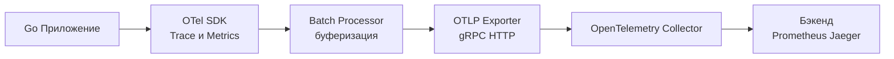

## Философия Observability в Go

Observability (Наблюдаемость) — это способность понимать внутреннее состояние системы по её внешним выходам. В монолитах PHP или Java это часто сводится к чтению логов. В распределенных Go-системах, где запрос проходит через десятки микросервисов, очередей и кэшей, классического отладчика недостаточно. Мы не можем остановить production для дебага.

Вместо этого мы проектируем систему так, чтобы она генерировала телеметрию, позволяющую задавать гипотезы: «Почему p99 вырос?» или «Где произошла потеря данных?». Observability состоит из трех столпов:
1. **Метрики (Metrics)**: Агрегированные данные (числа). Отвечают на вопрос «Система здорова?».
2. **Логи (Logs)**: Дискретные события (текст). Отвечают на вопрос «Что произошло?».
3. **Трейсы (Traces)**: Распределенный путь выполнения. Отвечают на вопрос «Как и где это произошло?».

### 1. OpenTelemetry (OTel): Единый стандарт

Ранее в Go использовались проприетарные SDK (Zipkin, Jaeger client, Datadog tracer). Сейчас индустриальным стандартом является **OpenTelemetry**. Это фреймворк, который абстрагирует генерацию телеметрии от её отправки.

Ваш код генерирует `Spans` и `Metrics`, используя OTel API, а `Exporter` отправляет их в бэкенд (Prometheus, Jaeger, Loki и т.д.).



> [!info] Под капотом
> OTel SDK в Go оптимизирован для минимального влияния на производительность. Процессор `BatchSpanProcessor` использует неблокирующий канал (`chan Span`) и фоновую горутину. Если вы создаете трейсы быстрее, чем экспорт может отправить их, канал заполняется до предела, и SDK начинает **дроппать** (отбрасывать) новые спаны, чтобы не блокировать бизнес-горутину и не приводить к Out Of Memory. Это гарантирует, что observability не остановит ваш сервис.

### 2. Трейсинг (Distributed Tracing) под капотом

Трейс — это дерево операций (`Span`). В Go это реализуется через контекст (`context.Context`).

```go
import (
    "context"
    "go.opentelemetry.io/otel"
    "go.opentelemetry.io/otel/trace"
)

func doWork(ctx context.Context) {
    // 1. Создаем спан, привязывая его к контексту
    ctx, span := otel.Tracer("my-service").Start(ctx, "operation-name")
    // 2. Гарантируем завершение спана при выходе из функции
    defer span.End()

    // 3. Передаем контекст дальше (в БД, HTTP клиент)
    callDatabase(ctx)
}
```

**Механика:** `otel.Tracer().Start()` создает структуру `Span` и помещает указатель на неё в `Context`. Когда вы вызываете `http.NewRequestWithContext(ctx, ...)`, OTel-хук (middleware) извлекает контекст, достает TraceID и SpanID, и добавляет их в заголовки HTTP (`traceparent`). Это позволяет связать запрос между сервисами.

> [!warning] Ловушка / Gotcha
> **Глубина контекста**: Каждый раз, когда вы добавляете значение в контекст (например, `context.WithValue`), создается новая структура `valueCtx`, которая указывает на родителя. Цепочка трейсов может быть очень длинной. В Go 1.21+ оптимизированы `valueCtx` через атомарные указатели, но чрезмерное добавление метаданных в контекст увеличивает потребление памяти (RSS) и нагрузку на GC, так как `valueCtx` аллоцируется в куче.

### 3. Влияние на производительность (Mechanical Sympathy)

Включение трейсинга "в лоб" может снизить пропускную способность сервиса на 10-20%.

1.  **Аллокации**: Создание `Span` — это выделение памяти. Миллионы спанов = миллионы аллокаций.
2.  **Сериализация**: Конвертация структур Go в Protobuf для отправки требует CPU.
3.  **Сетевой I/O**: Отправка данных потребляет сокет и буферы ядра.

**Решение: Семплирование (Sampling)**
Никогда не собирайте 100% трейсов в Production. Это дорого и бесполезно. Используйте:
*   **Head Sampling**: Решение принимается на входе (например, каждый 10-й запрос). Дешево, но можно пропустить редкий баг.
*   **Tail Sampling**: Решение принимается после завершения запроса (например, сохранять только ошибки или медленные запросы). Требует буферизации, но точнее. В Go для этого часто используют `otelcol` с расширениями `tail_sampling`.

### 4. Интеграция с Метриками и Логами

Телеметрия должна быть связана. TraceID из трейса должен попадать в логи и метрики.

**Логирование (Slog + OTel):**
```go
// Добавляем TraceID и SpanID в каждый лог
import "go.opentelemetry.io/otel/trace"

func logWithTrace(ctx context.Context, msg string) {
    spanCtx := trace.SpanContextFromContext(ctx)
    if spanCtx.IsValid() {
        slog.Info(msg, 
            "trace_id", spanCtx.TraceID().String(),
            "span_id", spanCtx.SpanID().String(),
        )
    } else {
        slog.Info(msg)
    }
}
```

### 5. Собеседование

> [!tip] Собеседование
> **Вопрос:** Как реализовать трейсинг в Go без использования внешних библиотек (для понимания базы)?
> **Ответ:** Использовать `context.Context` для передачи ID запроса (например, `X-Request-ID`). При каждом вызове внешней системы генерировать UUID и класть в контекст. В логах печатать этот ID. Это "бедный человек трейсинг". Полноценный трейсинг требует иерархии (родительский ID) и таймингов.
> 
> **Вопрос:** Что будет, если OTel Collector упадет?
> **Ответ:** Хорошо настроенный SDK имеет `BatchProcessor` с ограниченным размером очереди. Он будет накапливать спаны в памяти до лимита, а затем дроппать их. Приложение не должно зависать или паниковать из-за недоступности системы сбора логов. Это называется "Degradation Gracefully".

### 6. Инструментарий в Go

*   **Metrics**: `github.com/prometheus/client_golang` (стандарт де-факто) или `go.opentelemetry.io/otel/sdk/metric`.
*   **Tracing**: `go.opentelemetry.io/otel/sdk/trace`.
*   **Profiling**: `net/http/pprof` (для CPU/Memory профилей).

### Итог

1.  **Observability** — это проектирование системы для диагностики, а не постфактум логирование.
2.  Используйте **OpenTelemetry** для унификации данных.
3.  Контекст (`ctx`) — это носитель идентификаторов трейса между функциями и сервисами.
4.  Всегда используйте `BatchProcessor` и лимиты очереди, чтобы телеметрия не убила приложение при проблемах в сети.
5.  Связывайте логи и трейсы через `TraceID`.
6.  Применяйте семплирование в Production, чтобы сэкономить ресурсы CPU и памяти.

Следующая статья: [[42. Логирование в production]]