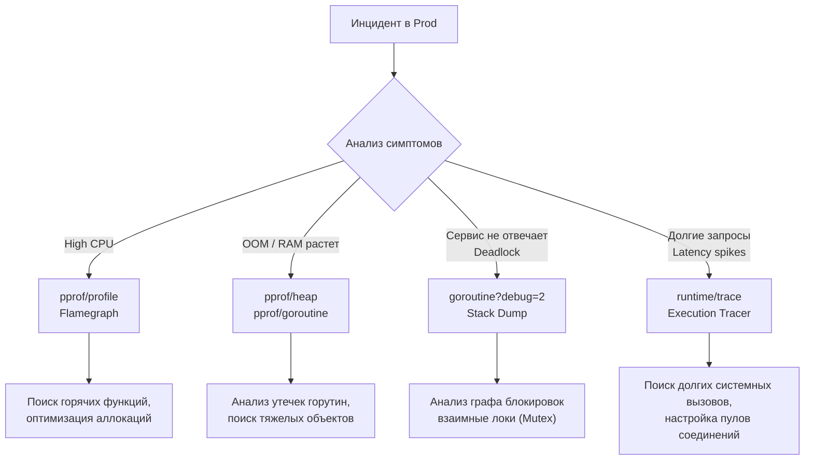

## Хирургия на живом пациенте: Debugging в Production

Локальная отладка и тестирование — это тепличные условия. В production ваше приложение сталкивается с сетевыми морганиями, дикими паттернами нагрузки, исчерпанием файловых дескрипторов и аппаратными сбоями. Когда сервис начинает потреблять 100% CPU в пятницу вечером или внезапно ловит OOM (Out Of Memory) от ядра Linux, `fmt.Println` и пошаговый дебаггер вас не спасут.

Дебаг в production — это процесс восстановления картины преступления по следам крови (логам, метрикам и дампам памяти). Если в статьях [[41. Observability основы]] и [[17. Метрики и базовый monitoring]] мы учились настраивать радары, то здесь мы будем использовать тяжелую артиллерию Go для препарирования работающего рантайма.

---

## 1. Большая тройка инструментов Go

Экосистема Go предоставляет фундаментально мощный встроенный инструментарий для профилирования и отладки, который можно и нужно использовать прямо в production-окружении (с некоторыми оговорками).

### pprof (Performance Profiler)
Это ваш главный скальпель. Пакет `net/http/pprof` позволяет снимать слепки состояния приложения прямо через HTTP-эндпоинт без остановки сервиса.

Подключение в HTTP-сервере:
```go
import _ "net/http/pprof"

func main() {
    // pprof автоматически регистрирует свои роуты в DefaultServeMux
    go func() {
        log.Println(http.ListenAndServe("localhost:6060", nil))
    }()
    // ... основной код сервиса ...
}
```

> [!warning] Ловушка / Gotcha
> Никогда не выставляйте порт с pprof в публичную сеть (Интернет). Он должен быть доступен только внутри приватной сети кластера или через port-forwarding (например, `kubectl port-forward`). Доступ к pprof позволяет злоумышленнику выкачать дамп памяти, где могут лежать ключи шифрования, пароли пользователей и токены!

### execution tracer (runtime/trace)
Если `pprof` отвечает на вопрос **«Где мы тратим время/память?»**, то tracer отвечает на вопрос **«Когда и как именно исполнялись горутины?»**. Трейсер записывает микросекундную историю планировщика (G-M-P), системных вызовов, блокировок каналов и пауз Garbage Collector.

### Delve (dlv) в режиме core dump
Пошагово отлаживать (attach) живой production-процесс с помощью `dlv attach` — плохая идея, так как вы останавливаете планировщик и обрываете клиентские запросы. Вместо этого используется анализ «посмертных дампов» (core dumps).

---

## 2. Анатомия проблем и их расследование

Разберем самые частые классы аварий и способы их диагностики.

### Сценарий А: Утечка памяти (Memory Leak)

В Go, благодаря Garbage Collector, классических утечек через забытый `free()` нет. Утечки в Go — это *удержание ссылок* на объекты, которые больше не нужны. 

**Симптом:** График использования RAM на дашборде постоянно растет вверх "лесенкой", не падая после завершения пика нагрузки. В итоге сервис умирает от OOM Killer.

**Расследование:**
1. Подключаемся к сервису и снимаем heap-профиль:
   ```bash
   go tool pprof -http=:8080 http://localhost:6060/debug/pprof/heap
   ```
2. Анализируем два режима:
   - `alloc_space` — показывает, где память *выделялась* за всё время жизни. Полезно для оптимизации нагрузки на GC.
   - `inuse_space` — показывает, что *занято прямо сейчас*. Ищем огромные квадраты на графе — это объекты, которые живы и не могут быть собраны GC.

> [!tip] Собеседование
> **Вопрос:** В чем самая частая причина утечки памяти в Go?
> **Ответ:** Утечка горутин (Goroutine Leak). Горутина, заблокированная навсегда (например, читает из пустого канала, в который никто никогда не напишет, или висит на HTTP-запросе без таймаута), не может быть собрана GC. А вместе с ней не могут быть собраны все переменные в её стеке и объекты, на которые эти переменные ссылаются. 

Чтобы проверить утечку горутин, запрашиваем:
```bash
go tool pprof http://localhost:6060/debug/pprof/goroutine
```
Если вы видите 100 000 горутин, висящих в `net/http.(*persistConn).readLoop`, — вы забыли установить `IdleConnTimeout` или не закрыли `Response.Body` при чтении.

### Сценарий Б: Утечка через под-слайсы (Slicing Leak)

Еще один коварный паттерн — создание маленького слайса поверх огромного массива.

```go
var globalCache []byte

func loadData() {
    giantFile := make([]byte, 1024*1024*100) // 100 MB
    // Читаем файл...
    // Нам нужен только заголовок (первые 10 байт)
    globalCache = giantFile[:10] 
}
```
**Что под капотом:** Слайс в Go — это структура из трех полей (pointer, len, cap). `globalCache` будет иметь `len=10`, но его указатель (`pointer`) ссылается на тот самый 100-мегабайтный `backing array`. Пока жив `globalCache`, весь массив на 100 МБ не будет собран Garbage Collector-ом!
**Решение:** Делать явное копирование `copy()`, аллоцируя новый маленький массив.

### Сценарий В: 100% CPU Spike

Сервис внезапно съедает все доступные ядра процессора и не может обработать новые запросы.

**Расследование:**
Снимаем профиль CPU за 30 секунд (по умолчанию):
```bash
go tool pprof -http=:8080 http://localhost:6060/debug/pprof/profile?seconds=30
```
В открывшемся браузере сразу переключаемся на вкладку **Flame Graph** (Огненный граф). Чем шире блок — тем больше процессорного времени заняла функция.

> [!info] Под капотом
> **Как работает CPU pprof?**
> Он не измеряет время выполнения каждой функции (это было бы слишком накладно). Он использует механизм *сэмплинга* (sampling).
> 1. Рантайм Go через системный вызов `setitimer` просит ОС отправлять процессу сигнал `SIGPROF` ровно 100 раз в секунду.
> 2. Когда ОС присылает `SIGPROF`, текущий тред ОС приостанавливается.
> 3. Обработчик сигнала в ядре Go (`runtime.sigtramp`) "смотрит", какая горутина сейчас выполняется, берет её Program Counter (указатель текущей инструкции), разворачивает стек вызовов (stack unwinding) и записывает этот трейс в буфер.
> 4. Тред возобновляет работу.
> В итоге `pprof` показывает статистическое распределение: если функция `json.Unmarshal` попала в 80% сэмплов, значит она жрет 80% времени CPU. Оверхед от такого профилирования в production составляет всего около 1-3%, поэтому его безопасно запускать на "живую".

**Частые причины высоких CPU спайков:**
1. Бесконечные циклы `for { ... }` без `runtime.Gosched()` или блокирующих операций (syscall, I/O, чтение из канала), которые съедают квант времени планировщика (spinlocks).
2. Тяжелая криптография или регулярные выражения (пакет `regexp` медленный, если выражения компилируются на каждый запрос).
3. Коллизии в хэш-таблицах (`map`), приводящие к деградации сложности поиска до O(N).
4. Чрезмерная нагрузка на Garbage Collector (GC Thrashing) — вы аллоцируете миллионы мелких объектов в секунду. GC вынужден забирать CPU-ресурсы для сканирования и очистки кучи (`runtime.gcDrain` будет занимать большую часть Flamegraph).

### Сценарий Г: Зависание сервиса (Deadlock) или деградация Latency

Процессор свободен, память в норме, но сервис не отвечает на запросы или делает это по 10 секунд.

**Расследование:**
Если это тотальный deadlock, поможет выгрузка стеков всех горутин (Full Goroutine Dump):
```bash
curl "http://localhost:6060/debug/pprof/goroutine?debug=2" > dump.txt
```
Параметр `debug=2` выдает сырой текстовый дамп, похожий на stacktrace при панике. Ищите горутины в состоянии `semacquire` (ждут Mutex) или `chan receive`/`chan send` (заблокированы на каналах).

Если сервис просто "тормозит", на помощь приходит **trace**:
```bash
curl -o trace.out "http://localhost:6060/debug/pprof/trace?seconds=5"
go tool trace trace.out
```
В UI трейсера можно увидеть:
- **GC pauses:** Как долго длились фазы "Stop the world". Если сервис простаивает миллисекунды, возможно GC работает слишком часто.
- **Network blocking / Syscalls:** Горутина может висеть, ожидая ответа от БД из-за сломанного пула соединений.
- **Scheduler latency:** Как долго горутина ждала в очереди `runq`, прежде чем M (тред ОС) взял её на исполнение P (процессором). Если тредов ОС меньше, чем блокировок, горутины будут "голодать".



## 3. Разбираемся с Out Of Memory (OOM Killer)

Одна из самых неприятных смертей процесса — когда его убивает ядро Linux. В логах приложения при этом не будет красивого stack trace, приложение просто завершится с `SIGKILL` (код 137).

Чтобы убедиться, что это был OOM Killer, нужно посмотреть системные логи:
```bash
dmesg -T | grep -i oom
```
Вы увидите сообщение вида: `Out of memory: Killed process 1234 (myapp) total-vm:..., anon-rss:...`.

**Почему Go приложение может уйти в OOM:**
1. **Непредсказуемые пики потребления (Spikes).** GC в Go реагирует на выделение памяти, базируясь на параметре `GOGC` (по умолчанию 100 — означает, что куча может вырасти на 100% от размера живых объектов после последней сборки, прежде чем запустится следующий цикл). Если в сервис прилетел массивный payload на 500 МБ, куча быстро раздуется до 1 ГБ, и если лимит контейнера (cgroups) стоит на 800 МБ — ОС убьет процесс быстрее, чем Go успеет запустить Garbage Collector.
2. **Особенности возврата памяти в ОС.** Ранее Go использовал вызов `MADV_DONTNEED`, отдавая память ОС немедленно. С определенных версий он стал использовать `MADV_FREE`, который говорит ядру: "Эта память мне не нужна, но если у тебя есть свободная оперативка — можешь оставить эти страницы за мной (как кэш)". Инструменты мониторинга (например, `top`) будут показывать, что Go "жрет" всю RAM, хотя по факту внутри рантайма она свободна. Это может провоцировать ложные срабатывания OOM Killer'ов в Kubernetes.

**Решение:**
В Go 1.19+ добавили возможность "мягко" ограничить аппетиты рантайма.
Устанавливайте переменную окружения `GOMEMLIMIT`. Например, если под в Kubernetes имеет лимит 1Gi, установите `GOMEMLIMIT=900MiB`. Тогда планировщик Go начнет агрессивно чистить мусор (и даже задействует CPU для непрерывного GC), когда потребление приблизится к этому порогу, избегая жестокого `SIGKILL` от операционной системы.

## Итог

Работа с инцидентами требует системного подхода и знания того, как язык работает "под капотом". 
- Используйте `pprof/profile` для поиска прожорливых алгоритмов.
- Используйте `pprof/heap` для контроля аллокаций (снизив аллокации, вы разгрузите CPU от работы GC).
- Используйте `pprof/goroutine` для поиска утечек горутин — главной причины утечек памяти.
- Остерегайтесь запуска `trace` и `mutex/block` профилей на высоконагруженном проде на долгое время — их оверхед значительно выше, чем у CPU сэмплинга.

Научившись диагностировать живой код, мы подходим к логическому завершению изучения процесса создания и поддержки боевых сервисов. В следующей статье мы подведем общую черту: [[44. Итоги раздела. Production backend на Go]].