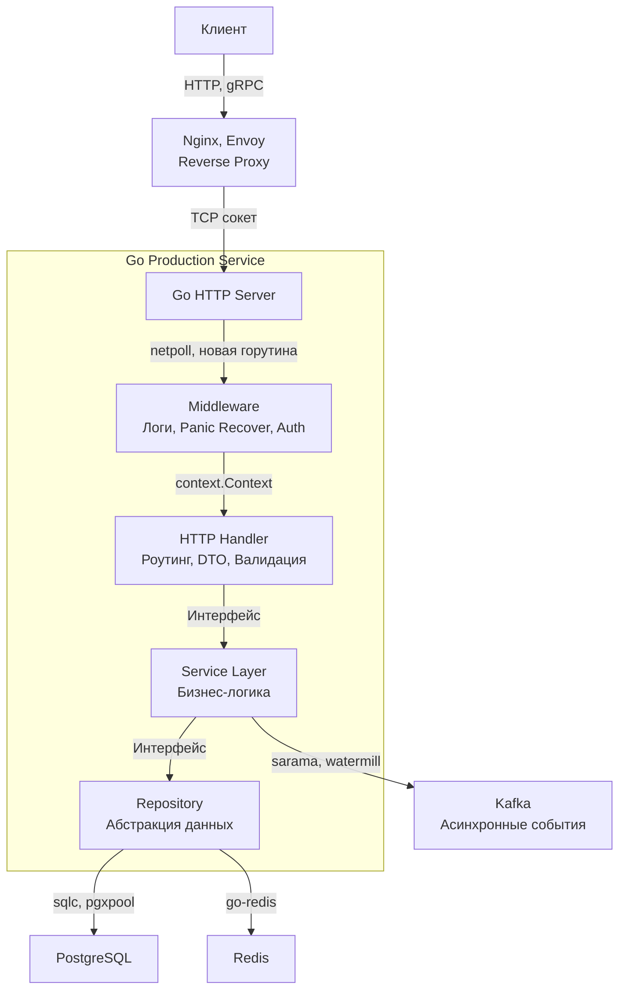

## Манифест Production-Ready Бэкенда на Go

Мы прошли огромный путь от базового понимания, зачем нужен `net/http` в [[3. net http сервер с нуля]], до препарирования живого процесса в условиях нехватки памяти в [[43. Debug production проблем]]. Раздел, посвященный практике разработки бэкенда на Go, подошел к концу. 

Написать код, который работает локально на машине разработчика — это 10% работы. Остальные 90% — это обеспечение предсказуемости, масштабируемости и наблюдаемости этого кода в суровых условиях production-среды. 

В этой итоговой статье мы сведем воедино все концепции, паттерны и подходы, которые отличают «поделку на коленке» от Enterprise-решения уровня Senior/Lead.

---

## Архитектура: Явное лучше неявного

Главная философия Go, которая отпугивает разработчиков из мира Java (Spring) или C# (.NET), — **отсутствие магии**. 

В Go нет скрытого инжектирования зависимостей через аннотации, нет "умных" ORM, которые лениво подтягивают данные из базы за вашей спиной (провоцируя N+1 запросы), и нет неявных глобальных состояний приложения, размазанных по десяткам конфигурационных XML или YAML файлов.

Вы собираете приложение своими руками в `main.go`. Это место называется **Composition Root** (корень композиции), как мы обсуждали в [[13. Dependency Injection в Go]]. Вы явно читаете конфиг, явно создаете логгер, явно открываете пул соединений к БД, явно прокидываете его в Repository, Repository — в Usecase, а Usecase — в HTTP Handler.

Такая архитектура дает 100% контроль над тем, как и когда выделяется память, как закрываются ресурсы при получении сигнала `SIGTERM` ([[10. Graceful shutdown]]), и позволяет легко подменять любые слои моками в тестах.

---

## Фундамент надежности (Resilience)

Production-сервис не живет в вакууме. Базы данных "моргают", сеть теряет пакеты, сторонние API отвечают по 15 секунд вместо 100 миллисекунд. Ваш бэкенд должен выживать в таких условиях.

### 1. Context — король бэкенда
Пакет `context` — это кровеносная система любого Go-сервиса. Каждый запрос, уходящий во внешнюю систему (БД, кэш, другой микросервис), **обязан** иметь таймаут. Если вы делаете HTTP-вызов без `context.WithTimeout`, вы закладываете бомбу замедленного действия, которая однажды "повесит" все горутины вашего сервера.

### 2. Паттерны отказоустойчивости
Сеньорный бэкенд не просто возвращает `500 Internal Server Error` при первой же проблеме сети. Он применяет техники выживания:
* **Ограничение потока:** Если запросов слишком много, мы отсекаем лишние на подлете с помощью паттернов, описанных в [[18. Rate limiting]].
* **Защита соседей:** Если партнерский API лег, мы перестаем его "долбить" запросами, используя [[30. Circuit breaker]], давая ему время на восстановление.
* **Сглаживание пиков:** Если временный сбой — мы делаем [[29. Retry и backoff]], экспоненциально увеличивая задержку между попытками.

### 3. Предсказуемое потребление ресурсов
В отличие от PHP (где каждый запрос — отдельный процесс/тред ОС, убивающийся после ответа), HTTP-сервер в Go — это долгоживущий демон. Утечка даже одной горутины или одного байта в глобальную мапу на каждый запрос приведет к смерти сервиса по OOM (Out Of Memory).

> [!info] Под капотом
> Ваш код должен обладать **Mechanical Sympathy** (механической симпатией к железу). 
> Когда миллион клиентов подключается к вашему серверу, Go не создает миллион тредов ОС (это убило бы ядро Linux на переключениях контекста). Рантайм Go использует неблокирующий IO (epoll в Linux) через внутренний механизм `netpoll`. 
> Горутина, ожидающая чтения из сокета, "паркуется" (переходит в состояние `Gwaiting`), освобождая тред процессора (`M`) для другой работы. Как только в сокет падают байты, `epoll` будит планировщик, и горутина мгновенно возвращается к работе. Это позволяет Go-серверу держать сотни тысяч соединений на сервере с 1-2 ГБ оперативной памяти.

---

## Observability: Слепой хирург не оперирует

Если у вас нет логов, метрик и трейсов — у вас нет production-сервиса, у вас есть "черный ящик", который может сломаться в любую секунду.

1.  **Логирование:** Мы отказались от стандартного `log.Println` в пользу структурированных логов (`log/slog` или `zap`), где каждая запись — это JSON. Это позволяет искать ошибки в ELK/Loki, агрегируя их по `user_id`, `trace_id` или `endpoint`.
2.  **Метрики:** В [[17. Метрики и базовый monitoring]] мы внедрили Prometheus. Сеньор обязан знать паттерн **RED** (Rate, Errors, Duration) и **USE** (Utilization, Saturation, Errors). Вы должны видеть 99-й перцентиль (p99) времени ответа вашего API, а не "среднюю температуру по больнице".
3.  **Трассировка:** Когда запрос проходит через 5 микросервисов, только `trace_id` в HTTP-заголовках позволяет связать все логи и спаны базы данных в единую картину.

> [!warning] Ловушка / Gotcha
> Частая ошибка новичков — пытаться использовать логи как метрики (например, парсить текстовые логи, чтобы посчитать количество ошибок 500). Логи — для детализации (почему сломалось). Метрики — для агрегации (как часто ломается). В высоконагруженных системах вы не сможете логировать 100% успешных `HTTP 200` запросов (вы сожжете диски и сеть), но вы обязаны инкрементировать счетчик в метриках для каждого запроса (это дешево, метрика хранится в RAM).

---

## Собеседование: Чек-лист Senior Go Engineer

Переход от Middle к Senior/Lead часто заключается не в знании хитрых фич языка, а в способности предвидеть падения и управлять состоянием системы. 

> [!tip] Собеседование
> Когда на System Design интервью вас просят спроектировать сервис на Go, интервьюер ждет от вас упоминания следующих аспектов:
> 1.  **Идемпотентность:** Что будет, если клиент отправит запрос на оплату дважды из-за таймаута сети? (Решение обсуждали в [[28. Idempotency]]).
> 2.  **Миграции БД:** Как вы будете обновлять схему таблицы в кластере на 10 инстансов вашего приложения без даунтайма? (Многофазные миграции, обратная совместимость).
> 3.  **Graceful Degradation:** Что будет отдавать ваш API, если Redis-кэш упадет? Упадет вместе с ним или пойдет в реплику/БД напрямую?
> 4.  **Асинхронность:** Если генерация отчета занимает 30 секунд, вы не держите HTTP-соединение, вы используете Message Broker и [[26. Background jobs]].

---

## Итог

Бэкенд на Go в Production — это торжество прагматизма. Язык намеренно ограничен в синтаксисе (нет классов, нет наследования, сложная и многословная обработка ошибок `if err != nil`), чтобы заставить вас фокусироваться на архитектуре данных, сетевом взаимодействии и строгом контроле ресурсов.

Мы закончили изучение практического инструментария для создания самого бэкенд-сервиса (роутинг, БД, очереди, деплой). Однако ни один микросервис не существует изолированно. Ему нужно общаться с фронтендом, мобильными приложениями и другими микросервисами по сети. 

Поэтому мы закрываем Раздел 9 и переходим к следующему фундаментальному блоку — **Раздел 10. Проектирование API и Сетевые протоколы**, где мы разберем анатомию REST, погрузимся в бинарный мир gRPC и Protobuf, и научимся строить контракты, которые не ломаются при обновлениях.