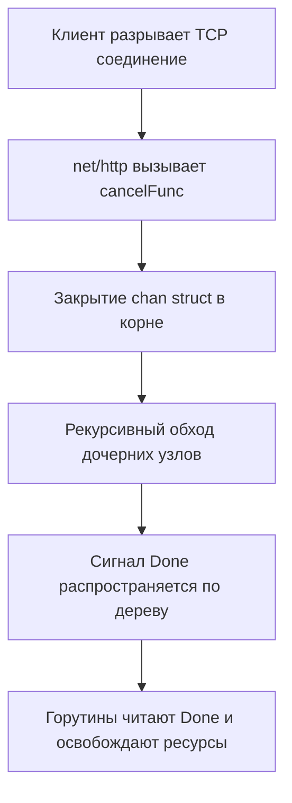

В `net/http` контекст — это не просто контейнер для значений, а механизм управления жизненным циклом запроса. Он связывает клиентское соединение, серверные таймауты и бизнес-логику в единую иерархию отмены. Понимание его устройства критично для написания сервисов, которые корректно освобождают ресурсы при разрыве соединения или деградации зависимостей.

1. Роль контекста в HTTP-запросах

Каждый входящий запрос `http.Request` уже содержит готовый контекст, доступный через `r.Context()`. Он создается рантаймом автоматически и отменяется в трех случаях:
- Клиент закрыл соединение (например, обновил страницу или истек таймаут на стороне браузера)
- Сервер начал graceful shutdown
- Разработчик явно вызвал `cancelFunc` для вложенного контекста

```go
func getUserHandler(w http.ResponseWriter, r *http.Request) {
    ctx := r.Context()
    
    // Контекст автоматически отменится при разрыве соединения
    select {
    case <-time.After(5 * time.Second):
        // Имитация долгой операции
        w.Write([]byte("User data"))
    case <-ctx.Done():
        log.Printf("Request canceled: %v", ctx.Err())
        return
    }
}
```

> [!info] Под капотом
> Внутри `net/http` при вызове `ServeHTTP` создается корневой контекст типа `cancelCtx`. Он не имеет родителя и живет ровно столько, сколько открыто соединение. Когда соединение закрывается, `net/http` вызывает `cancel()` для этого контекста, запуская каскадную отмену всех вложенных операций.

2. Механика отмены и дерево контекстов

Контексты в Go образуют дерево. Каждый узел может иметь тип:
- `cancelCtx`: базовый узел отмены
- `timerCtx`: содержит `time.Timer` для дедлайна
- `valueCtx`: хранит пару ключ-значение

При отмене родителя сигнал передается детям синхронно, глубинным обходом. Каждый `cancelCtx` хранит список своих детей в слайсе. При вызове `cancel()` итерируется по слайсу и рекурсивно вызывает их отмену.



Сигнал отмены доставляется через закрытие канала `Done()` (`chan struct{}`). Закрытие канала — операция O(1), но она будит все горутины, ожидающие чтения из этого канала. Планировщик Go (`runtime`) помечает их как ready и перекидывает в очередь P.

3. Таймауты и дедлайны

Для ограничения времени выполнения операций используйте `context.WithTimeout` или `context.WithDeadline`. Оба создают `timerCtx`, но с разной семантикой:
- `WithTimeout`: относительный таймаут от текущего момента
- `WithDeadline`: абсолютное время в будущем

```go
func fetchWithTimeout(ctx context.Context) error {
    // Всегда получаем cancelFunc и defer-им его
    ctx, cancel := context.WithTimeout(ctx, 2*time.Second)
    defer cancel() // Гарантирует освобождение таймера и горутин

    // Выполняем операцию, передавая обновленный контекст
    if err := db.Query(ctx, "SELECT ..."); err != nil {
        // Если контекст отменен, err может быть context.Canceled
        // или context.DeadlineExceeded
        if errors.Is(err, context.DeadlineExceeded) {
            return fmt.Errorf("query exceeded timeout: %w", err)
        }
        return err
    }
    return nil
}
```

> [!warning] Ловушка / Gotcha
> Если вы забудете вызвать `defer cancel()`, таймер `time.Timer` останется в памяти и будет ждать срабатывания. Для `WithTimeout` это утечка памяти и горутин. При тысячах запросов в секунду это приведет к быстрому исчерчанию ресурсов и панике сервера.

4. Передача данных через context

`context.WithValue` позволяет передавать request-scoped данные (идентификатор запроса, ID пользователя, язык локализации). Это **не** замена Dependency Injection.

```go
type ctxKey int

const userIDKey ctxKey = 0

func authMiddleware(next http.Handler) http.Handler {
    return http.HandlerFunc(func(w http.ResponseWriter, r *http.Request) {
        userID := extractToken(r) // условно извлекаем ID
        // Создаем новый контекст с данными
        ctx := context.WithValue(r.Context(), userIDKey, userID)
        next.ServeHTTP(w, r.WithContext(ctx))
    })
}

func getUser(w http.ResponseWriter, r *http.Request) {
    uid, ok := r.Context().Value(userIDKey).(string)
    if !ok {
        http.Error(w, "unauthorized", http.StatusUnauthorized)
        return
    }
    // Использование uid...
}
```

> [!tip] Собеседование
> Вопрос: Почему не стоит хранить конфигурацию или подключение к БД в контексте?
> Ответ: Контекст предназначен для управления жизненным циклом запроса и передачи метаданных конкретного запроса. Конфигурация и соединения — это зависимости сервиса. Их хранение в контексте ломает явные контракты, усложняет тестирование, скрывает реальные зависимости и создает скрытые аллокации. Используйте конструкторы сервисов или внедрение зависимостей.

5. Типичные ошибки и антипаттерны

- **Блокировка без проверки `ctx.Err()`**: После выхода из блокирующей функции (например, `db.Query`), всегда проверяйте, не был ли контекст отменен. Иначе вы можете вернуть данные клиенту, который уже отключился, или продолжить выполнение бесполезной цепочки.
- `context.Background()` в обработчике: Никогда не создавайте `context.Background()` внутри HTTP-обработчика, если вы не запускаете фоновую задачу, которая должна жить после ответа. Используйте `r.Context()`.
- **Игнорирование `context.Canceled` vs `context.DeadlineExceeded`**: `Canceled` означает намеренную отмену (клиент ушел). `DeadlineExceeded` — таймаут. Логирование и метрики должны различать эти случаи.
- **Мутабельные данные в контексте**: Никогда не передавайте указатели на изменяемые структуры. Контекст должен быть иммутабельным.

```go
// Правильная обработка отмены после блокирующей операции
func handler(w http.ResponseWriter, r *http.Request) {
    res, err := service.FetchData(r.Context())
    if err != nil {
        if errors.Is(err, context.Canceled) || errors.Is(err, context.DeadlineExceeded) {
            // Клиент ушел или таймаут. Логируем и завершаем.
            return
        }
        http.Error(w, "internal error", http.StatusInternalServerError)
        return
    }
    
    json.NewEncoder(w).Encode(res)
}
```

6. Производительность и Mechanical Sympathy

Работа с контекстом имеет измеримую стоимость на уровне CPU и памяти:
- **Аллокации**: Каждый вызов `context.WithValue` выделяет новую структуру `valueCtx` в куче. Цепочка из 10 значений = 10 аллокаций. Escape Analysis не может поместить их в стек, так как они передаются по ссылкам.
- **Поиск значений**: `valueCtx` реализован как связный список. Поиск `ctx.Value(key)` работает за O(n), где n — глубина вложенности. При глубине > 50 это заметно сказывается на CPU-циклах.
- **Кэш-линии**: Глубокие цепи контекстов разбрасывают структуры по разным адресам памяти. При обходе дерева отмены происходит cache miss, что замедляет распространение сигнала.
- `Done()` канал: Закрытие канала `chan struct{}` дешево, но пробуждение тысяч горутин создает contention на уровне планировщика. Используйте контексты для отмены тяжелых операций (DB, IO, внешние API), а не для легковесных вычислений.

> [!info] Под капотом
> В Go 1.21+ рантайм оптимизировал обработку отмены: `cancelCtx` использует атомарный флаг `done` для быстрого пути, и только при наличии ожидающих горутин обращается к каналу. Это снижает накладные расходы на 30-40% в сценариях без активного ожидания `ctx.Done()`.

7. Итог

- Используйте `r.Context()` как корень для всех операций внутри обработчика.
- Всегда `defer cancel()` для таймаутов.
- Контекст — для отмены и request-scoped метаданных, не для DI.
- Проверяйте `ctx.Err()` после любой блокирующей операции.
- Минимизируйте глубину `WithValue` для сохранения производительности и локальности кэша.

Правильное использование контекста превращает HTTP-сервис из набора разрозненных горутин в управляемую, предсказуемую систему, которая корректно реагирует на сбои сети и ограничения ресурсов.

Следующая статья: [[10. Graceful shutdown]]